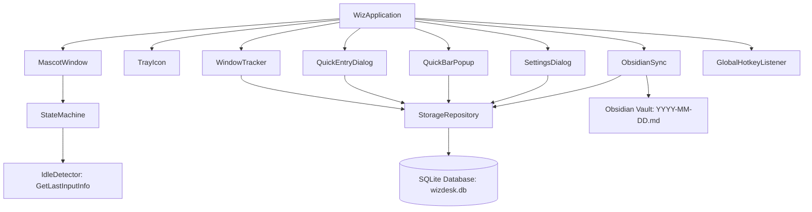

<div align="center">


# WizDesk

**A Minimalist Desktop Companion for Work Tracking, Hierarchical Tasks, and Obsidian Markdown Sync**

[](https://www.python.org/)
[](https://www.riverbankcomputing.com/software/pyqt/)
[](https://www.microsoft.com/windows)
[](https://www.sqlite.org/)
[](https://obsidian.md/)
[](LICENSE)
[](tests/)

<br />

[Quickstart](#quickstart--installation) &bull; [Key Capabilities](#key-capabilities) &bull; [Mascot Gestures](#1-floating-mascot-companion--gesture-engine) &bull; [Dark Mode](#8-comprehensive-dark--light-mode-system) &bull; [Obsidian Sync](#6-real-time--automatic-obsidian-daily-sync) &bull; [Settings](#configuration--settings) &bull; [Testing](#automated-verification--testing)

</div>

---

## Table of Contents

- [Product Introduction](#product-introduction)
- [Product Overview & User Experience](#product-overview--user-experience)
- [Key Capabilities](#key-capabilities)
  - [1. Floating Mascot Companion & Gesture Engine](#1-floating-mascot-companion--gesture-engine)
  - [2. Quick Task & Quick Note Floating Popups](#2-quick-task--quick-note-floating-popups)
  - [3. Calendar Date Navigation & Historical Isolation](#3-calendar-date-navigation--historical-isolation)
  - [4. Hierarchical Tasks, Subtasks & Status Dropdowns](#4-hierarchical-tasks-subtasks--status-dropdowns)
  - [5. Inline Renaming & Compact Timestamp Ranges](#5-inline-renaming--compact-timestamp-ranges)
  - [6. Real-Time & Automatic Obsidian Daily Sync](#6-real-time--automatic-obsidian-daily-sync)
  - [7. Passive Window & Context Activity Tracker](#7-passive-window--context-activity-tracker)
  - [8. Comprehensive Dark & Light Mode System](#8-comprehensive-dark--light-mode-system)
- [Architecture & Design System](#architecture--design-system)
  - [System Architecture](#system-architecture)
  - [UI Design System Primitives](#ui-design-system-primitives)
- [Quickstart & Installation](#quickstart--installation)
  - [Prerequisites](#prerequisites)
  - [Installation Steps](#installation-steps)
  - [Running the Application](#running-the-application)
- [Keyboard Shortcuts & Mouse Gestures](#keyboard-shortcuts--mouse-gestures)
- [Configuration & Settings](#configuration--settings)
- [Automated Verification & Testing](#automated-verification--testing)
- [Repository Structure](#repository-structure)
- [Roadmap](#roadmap)
- [License & Credits](#license--credits)

---

## Product Introduction

**WizDesk** is a lightweight, privacy-first desktop companion for Windows engineered to streamline daily productivity, task management, and personal knowledge synchronisation.

Traditional project management tools often interrupt deep work with heavyweight interfaces and slow loading times. WizDesk lives quietly on your screen as an animated companion mascot, passively logs your active applications in the background every 5 minutes, captures structured tasks and quick notes in under two seconds via double/triple-clicks or global hotkeys, and compiles your entire day into clean Markdown entries directly inside your **Obsidian Vault**.

---

## Product Overview & User Experience

WizDesk combines a minimal ambient presence with an interface engineered around keyboard-first and gesture-first interactions:

1. **Ambient Companion**: A frameless, transparent ghost mascot that sits unobtrusively above your active windows with smooth floating breathing animations. It responds dynamically to your real-time input and system idle state (`idle`, `working`, `notify`, `complete`, and `sleep`).
2. **Gesture-Driven Quick Entry**: Left double-click on Wiz to pop up a floating **Quick Task Bar**, or left triple-click to pop up a floating **Quick Note Bar** right next to the mascot.
3. **Workspace Window**: A clean card-based workspace featuring a segmented view switcher between **Tasks** and **Quick Notes**, interactive calendar date navigation with unified dropdowns, status dropdowns, expandable project groups, and dedicated section selectors.
4. **Comprehensive Theming**: Seamless instant switching between a refined **Light Theme** and a sleek **Dark Theme** (`#121214` / `#18181B`).
5. **Local-First SQLite Storage**: All logs, tasks, and notes are indexed locally in a structured SQLite database (`wizdesk.db`) with zero external network dependencies.
6. **Real-Time Markdown Export**: Direct, live synchronization to Obsidian daily notes whenever work is created or updated.

---

## Key Capabilities

### 1. Floating Mascot Companion & Gesture Engine
- **Frameless and Draggable**: Freely position the companion anywhere across multiple monitors with automatic coordinate persistence.
- **Automated Win32 Idle Engine**: Powered by Windows `GetLastInputInfo` measuring system-wide keyboard and mouse inactivity with zero performance overhead:
  - **Active Typing / Mouse Movement** &rarr; Wiz enters `WORKING` (focused animation).
  - **10 Seconds Inactivity** &rarr; Wiz enters `IDLE` (calm resting state).
  - **60 Seconds Inactivity** &rarr; Wiz enters `SLEEP` (sleepy half-lids).
  - **Adding Task / Subtask** &rarr; Wiz enters `NOTIFY` (wide eyes for 3.5s).
  - **Completing / Cancelling Task** &rarr; Wiz enters `COMPLETE` (celebration smile for 3.5s).
- **Clean Context Menu**: Right-click the mascot to open the workspace, manually switch states, open settings, hide the mascot, or cleanly quit the application.

### 2. Quick Task & Quick Note Floating Popups
- **Left Double-Click on Mascot** &rarr; Instantly displays the floating **Quick Task Bar** adjacent to Wiz.
- **Left Triple-Click on Mascot** &rarr; Instantly displays the floating **Quick Note Bar** adjacent to Wiz.
- **Smart Docking**: Automatically docks above or below the mascot without clipping off screen edges.
- **Instant Focus**: Text field is automatically focused on trigger; press `Enter` to commit or `Esc` to dismiss.

### 3. Calendar Date Navigation & Historical Isolation
- **Day-by-Day Isolation**: Today's tasks are exclusively shown for today. Past work is neatly filed under its respective creation date.
- **Interactive Calendar Popover**: Click `<` and `>` to browse previous days or click the date title to open an interactive popover calendar widget.
- **Unified Dropdown Navigation**: Matching, minimalist `QComboBox` drop boxes for Month and Year selection with neutral grey headers and a crisp selection pill.

### 4. Hierarchical Tasks, Subtasks & Status Dropdowns
- **Status Dropdowns**: Change task status directly via an inline combobox (`Task`, `In progress`, `Completed`, `Cancelled`) with color-coded status badges.
- **Parent Tasks & Subtasks**: Break down complex work items into structured subtasks with dedicated completion tracking.
- **Decoupled Completion Logic**: Marking individual subtasks as done tracks their state independently without prematurely closing the parent task.
- **4-Stage Segmented Filter**: Filter tasks instantly with capsule tabs:
  - `Task`: Active items awaiting action.
  - `In progress`: Real-time view of ongoing tasks.
  - `Completed`: Archived log of finished work items.
  - `Cancelled`: Discarded tasks maintained for historical context.

### 5. Inline Renaming & Compact Timestamp Ranges
- **Inline Renaming**: Double-click or right-click any task or subtask to rename it inline. Press `Enter` to commit or `Escape` to cancel.
- **Compact Time Ranges**: Clean parenthetical timestamps without unnecessary text prefixes:
  - Active: `(1:36 PM)`
  - Completed / Cancelled: `(1:36 PM - 1:57 PM)`
- Timestamps are placed neatly below the title to avoid edge cutoffs on long task names.

### 6. Real-Time & Automatic Obsidian Daily Sync
- **Live Markdown Syncing**: Automatically updates your daily markdown note (`WizDesk Logs/YYYY-MM-DD.md`) in your Obsidian vault whenever tasks or notes are added, edited, or checked off.
- **Periodic & Shutdown Flush**: Flushes activity summaries every 5 minutes and on application exit.
- **Vault Formatting Preview**:

```markdown
## 2026-09-02

### Tasks
- [x] Finalize landing page wireframes (Work)
  - [x] Design desktop hero mockup
  - [x] Design mobile responsiveness layout
- [/] Conduct user testing on prototypes (Work)
- [ ] Explore motion interaction ideas (Work)

### Auto-tracked
- 09:00-09:05 - Code (popup_dialog.py - Wiz)
- 09:05-09:10 - Obsidian (Daily Notes - Vault)

### Notes
- [x] [Work] Investigated background window polling performance (09:15)
- [ ] [Work] Drafted initial system architecture (14:30)
```

### 7. Passive Window & Context Activity Tracker
- **Background Activity Poller**: Samples active window titles and process names every 5 minutes via Windows Win32 APIs.
- **Automatic Project Tagging**: Matches window titles against customizable project keywords configured in SQLite.
- **Privacy-First**: Records window titles and durations without logging keystrokes or screen captures.

### 8. Comprehensive Dark & Light Mode System
- **Quick Theme Switcher**: Toggle between Light and Dark mode using the `☀` / `☾` icon in the workspace header or via the Settings dialog.
- **Live Theme Synchronization**: Changing the theme instantly refreshes all open dialogs, popups, and calendar widgets without requiring a restart.
- **Tailored Palettes**: High-contrast, accessibility-tested dark mode with rich charcoal surfaces (`#18181B`), deep frames (`#121214`), and crisp text (`#F4F4F5`).

---

## Architecture & Design System

### System Architecture



### UI Design System Primitives

| Property | Light Mode Token | Dark Mode Token | Usage |
| :--- | :--- | :--- | :--- |
| **Outer Window Frame** | `#E6E6EA` | `#121214` | Frameless window container (24px radius) |
| **Primary Canvas Card** | `#FFFFFF` | `#18181B` | Inner workspace cards, task containers, modal cards |
| **Border Tone** | `#D8D8DE` / `#ECECEF` | `#27272A` | Card outlines and subtle division rules |
| **Input Surface** | `#F4F4F5` | `#27272A` | Quick-add line inputs and section combobox fields |
| **Primary Text** | `#18181B` | `#F4F4F5` | Headings, task titles, active labels |
| **Secondary Text** | `#71717A` | `#A1A1AA` | Timestamps, section tags, empty state hints |
| **Action Accent Button**| `#18181B` | `#FAFAFA` | Primary action buttons (`Add`, `Save`, `Log Note`) |
| **Drop Shadows** | `rgba(0,0,0, 0.14)` | `rgba(0,0,0, 0.28)` | Elevated frameless modals and quick bar popups |

---

## Quickstart & Installation

### Prerequisites
- **Operating System**: Windows 10 or Windows 11 (64-bit)
- **Python**: Python 3.10, 3.11, 3.12, or 3.14

### Installation Steps

1. **Clone the repository**:
   ```bash
   git clone https://github.com/Lukog10/WizDesk.git
   cd WizDesk
   ```

2. **Create and activate a virtual environment**:
   ```powershell
   python -m venv .venv
   .venv\Scripts\Activate.ps1
   ```

3. **Install project dependencies**:
   ```bash
   pip install -r requirements.txt
   ```

### Running the Application

Launch WizDesk directly via the Python module:
```bash
python -m wiz
```

---

## Keyboard Shortcuts & Mouse Gestures

| Gesture / Shortcut | Scope | Action |
| :--- | :--- | :--- |
| **Left Double-Click** | Mascot Widget | Pop up floating **Quick Task Bar** near mascot |
| **Left Triple-Click** | Mascot Widget | Pop up floating **Quick Note Bar** near mascot |
| `Ctrl + Shift + W` | Global (System-Wide) | Open or focus the full **Workspace Window** |
| `Enter` | Workspace / Quick Bars | Submit and save a new task, note, or renamed title |
| `Escape` | Workspace / Quick Bars / Modals | Close dialog, dismiss quick bar, or cancel inline rename |
| **Double Click** | Task / Subtask Title | Inline rename task or subtask |
| **Left Click + Drag** | Mascot / Title Bar | Move the frameless window across the desktop |
| **Right Click** | Mascot / Task / Subtask / Tray | Open context menus for status, renaming, and settings |

---

## Configuration & Settings

WizDesk maintains persistent settings and application data in standard Windows application directories:

- **Configuration File**: `%APPDATA%\WizDesk\config.json`
- **Database File**: `%APPDATA%\WizDesk\wizdesk.db`
- **Logs Directory**: Configurable via Settings Dialog (Defaults to `/WizDesk Logs/` in your Obsidian vault)

### Settings Dialog Options:
- **Obsidian Vault Path**: Directory browser for linking your local Obsidian vault root.
- **Dark Mode Toggle**: Switch between Light and Dark mode globally.
- **Auto-Tracking Interval**: Configurable polling timer (Default: Every 5 minutes).
- **Animation Toggle**: Enable or disable the floating bob animation for the mascot.
- **Project Keyword Rules**: Configure keyword associations for automatic process classification.

---

## Automated Verification & Testing

WizDesk features a comprehensive automated test suite powered by `pytest` and `pytest-qt`:

```bash
.venv\Scripts\pytest.exe -v
```

### Verified Test Matrix (28 Tests Passing):
- `test_dialogs.py`: Validates task flows, subtasks, note creation, section changes, checkboxes, calendar navigation, status dropdowns, inline renaming, timestamps, custom modals, dark mode toggles, quick bar popups, and multi-click gestures.
- `test_mascot_core.py`: Verifies state machine transitions, automated Win32 idle and sleep transitions, configuration defaults, tray icon initialization, mascot rendering, and graceful quit signal handling.
- `test_obsidian_sync.py`: Tests Markdown parsing, daily log generation, and file synchronization routines.
- `test_storage.py`: Tests session tracking, hierarchical task queries, subtask status updates, task renaming, timestamps, note persistence, and keyword matching.

---

## Repository Structure

```text
WizDesk/
├── assets/                          # Vector SVGs, icons, and brand assets
│   ├── idle.svg                     # Primary favicon asset
│   ├── wiz-idle.svg                 # Mascot resting state
│   ├── wiz-working.svg              # Mascot working animation state
│   ├── wiz-notify.svg               # Mascot notification state
│   ├── wiz-complete.svg             # Mascot completion celebration state
│   ├── wiz-sleep.svg                # Mascot sleeping state
│   ├── WizDesk Logo v1.jpeg         # Official WizDesk Logo (v1)
│   └── WizDesk Logo v2.jpeg         # Official WizDesk Logo (v2)
├── tests/                           # Automated pytest suite (28 tests)
│   ├── conftest.py                  # Pytest configuration & environment fixtures
│   ├── test_dialogs.py              # UI, modal, calendar, quick bar, and task row tests
│   ├── test_mascot_core.py          # State machine, idle engine, and quit signal tests
│   ├── test_obsidian_sync.py        # Markdown parser and vault sync tests
│   └── test_storage.py              # SQLite storage repository tests
├── wiz/                             # Core Python application package
│   ├── core/                        # Configuration, signals, state machine, and idle detector
│   │   ├── config.py
│   │   ├── idle_detector.py         # Win32 GetLastInputInfo idle engine
│   │   ├── signals.py
│   │   └── state_machine.py
│   ├── storage/                     # SQLite database models and queries
│   │   ├── db.py
│   │   └── models.py
│   ├── sync/                        # Obsidian Markdown exporter & real-time sync
│   │   └── obsidian.py
│   ├── tracker/                     # Windows activity poller (5-min interval)
│   │   └── window_tracker.py
│   ├── ui/                          # PyQt6 widgets, dialogs, calendar, and icons
│   │   ├── icons.py
│   │   ├── mascot_widget.py
│   │   ├── mascot_window.py
│   │   ├── popup_dialog.py
│   │   ├── quick_bar_dialog.py      # Quick Task & Note floating popups
│   │   ├── settings_dialog.py
│   │   └── tray_icon.py
│   ├── utils/                       # Global hotkey listeners
│   │   └── hotkey.py
│   ├── __init__.py
│   └── __main__.py                  # Application entry point
├── pyproject.toml                   # Project metadata and pytest configuration
├── requirements.txt                 # Runtime dependencies
├── Wiz-PRD.md                       # Comprehensive Product Requirements Document
├── context.md                       # System architecture and knowledge baseline
└── README.md                        # Project documentation
```

---

## Roadmap

- [x] Floating mascot widget with animated states & Win32 automated idle engine
- [x] Multi-click gesture engine: Left double-click (Quick Task bar) & triple-click (Quick Note bar)
- [x] Minimalist task hierarchy with subtasks and decoupled completion
- [x] Calendar date navigation, unified dropdowns & historical day isolation
- [x] Task status dropdowns (`Task`, `In progress`, `Completed`, `Cancelled`)
- [x] Inline task & subtask renaming (double-click or context menu)
- [x] Compact timestamp ranges (`start - end`)
- [x] Comprehensive Light & Dark mode support across all dialogs and widgets
- [x] 5-minute passive window tracking & real-time Obsidian daily note sync
- [x] Quick progress notes with interactive section changing
- [x] Custom frameless section modal dialog
- [x] Multi-resolution SVG favicon and application icons
- [ ] Dedicated **Log Activity** timeline view with historical heatmaps
- [ ] Dedicated **Project Tracking** dashboard
- [x] Standalone Windows executable packaging (`dist/WizDesk/WizDesk.exe`)
- [ ] Version 2: Native Linux support (X11/Wayland desktop companion & AppImage/package)
- [ ] Dedicated **Log Activity** timeline view with historical heatmaps
- [ ] Dedicated **Project Tracking** dashboard

---

## Standalone Windows Executable (.exe)

WizDesk is fully configured for legal, secure, and production-grade standalone packaging using PyInstaller.

### Building the Executable

1. **Activate Virtual Environment & Install Build Dependencies:**
   ```powershell
   .venv\Scripts\activate
   pip install -r requirements.txt
   ```

2. **Run PyInstaller Build:**
   ```powershell
   pyinstaller wizdesk.spec --clean --noconfirm
   ```

3. **Output:**
   The compiled application will be located in `dist/WizDesk/`:
   * `WizDesk.exe`: Main standalone executable (runs silently in GUI mode without a black terminal window).
   * `assets/`: Bundled vector SVGs and multi-layer application icons.
   * `LICENSE`: GNU GPL v3 license agreement.
   * `THIRD_PARTY_LICENSES.md`: Complete legal attribution for all bundled open-source dependencies.

### Security & Integrity Features
* **Antivirus Heuristic Protection**: UPX compression is explicitly disabled (`upx=False`) to avoid false-positive malware flags by Windows Defender and enterprise security tools.
* **Windows PE Version Metadata**: Embedded `VSVersionInfo` resource declaring company name, file description, version (`1.0.0.0`), and product identity.
* **Least Privilege Execution**: Configured with UAC execution level `asInvoker` (`uac_admin=False`), never requiring administrative elevation.
* **User Data Isolation**: User databases and settings persist in `%APPDATA%\WizDesk` on Windows (and standard XDG directories on Linux).

---

## License & Credits

Distributed under the **GNU General Public License v3 (GPL v3)**. See [LICENSE](LICENSE) and [THIRD_PARTY_LICENSES.md](THIRD_PARTY_LICENSES.md) for details.

Created and designed by **Gokul R** &bull; [GitHub Profile](https://github.com/Lukog10)