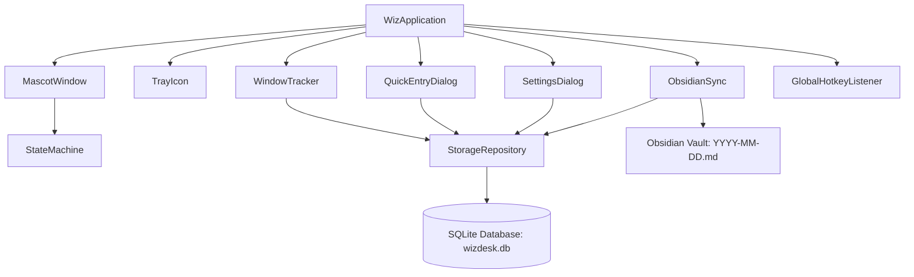

<div align="center">


# WizDesk

**A Minimalist Desktop Companion for Work Tracking, Hierarchical Tasks, and Obsidian Markdown Sync**

[](https://www.python.org/)
[](https://www.riverbankcomputing.com/software/pyqt/)
[](https://www.microsoft.com/windows)
[](https://www.sqlite.org/)
[](https://obsidian.md/)
[](LICENSE)
[](tests/)

<br />

[Quickstart](#quickstart--installation) &bull; [Key Capabilities](#key-capabilities) &bull; [Architecture](#architecture--design-system) &bull; [Obsidian Sync](#6-automatic-obsidian-daily-sync) &bull; [Settings](#configuration--settings) &bull; [Testing](#automated-verification--testing)

</div>

---

## Table of Contents

- [Product Introduction](#product-introduction)
- [Product Overview & User Experience](#product-overview--user-experience)
- [Key Capabilities](#key-capabilities)
  - [1. Floating Mascot Companion](#1-floating-mascot-companion)
  - [2. Hierarchical Tasks & Subtasks](#2-hierarchical-tasks--subtasks)
  - [3. Quick Progress Notes](#3-quick-progress-notes)
  - [4. Dynamic Section Management](#4-dynamic-section-management)
  - [5. Passive Window & Context Tracker](#5-passive-window--context-tracker)
  - [6. Automatic Obsidian Daily Sync](#6-automatic-obsidian-daily-sync)
- [Architecture & Design System](#architecture--design-system)
  - [System Architecture](#system-architecture)
  - [UI Design System Primitives](#ui-design-system-primitives)
- [Quickstart & Installation](#quickstart--installation)
  - [Prerequisites](#prerequisites)
  - [Installation Steps](#installation-steps)
  - [Running the Application](#running-the-application)
- [Keyboard Shortcuts & Hotkeys](#keyboard-shortcuts--hotkeys)
- [Configuration & Settings](#configuration--settings)
- [Automated Verification & Testing](#automated-verification--testing)
- [Repository Structure](#repository-structure)
- [Roadmap](#roadmap)
- [License & Credits](#license--credits)

---

## Product Introduction

**WizDesk** is a lightweight, privacy-first desktop companion for Windows engineered to streamline daily productivity, task management, and knowledge base synchronisation.

Traditional project management tools often interrupt deep work with heavyweight interfaces and slow loading times. WizDesk lives quietly on your screen as an animated companion mascot, passively logs your active applications in the background every 30 minutes, captures structured tasks and quick notes in under two seconds via global hotkeys, and compiles your entire day into clean Markdown entries directly inside your **Obsidian Vault**.

---

## Product Overview & User Experience

WizDesk combines a minimal ambient presence with an interface engineered around keyboard-first interactions:

1. **Ambient Companion**: A frameless, transparent ghost mascot that sits unobtrusively above your active windows with smooth floating breathing animations. It responds dynamically with expressive state faces (`idle`, `working`, `notify`, `complete`, and `sleep`).
2. **Workspace Window**: A clean card-based workspace featuring a segmented view switcher between **Tasks** and **Quick Notes**, a real-time calendar header, filter capsules, expandable project groups, and dedicated section selectors.
3. **Local-First SQLite Storage**: All logs, tasks, and notes are indexed locally in a structured SQLite database (`wizdesk.db`) with zero external network dependencies.
4. **Markdown Export**: Direct synchronization to Obsidian daily notes without complex third-party plugins.

---

## Key Capabilities

### 1. Floating Mascot Companion
- **Frameless and Draggable**: Freely position the companion anywhere across multiple monitors with automatic coordinate persistence.
- **Expressive State Engine**: Driven by a state machine that transitions across five vector-rendered visual states:
  - `IDLE`: Resting state with calm eyes.
  - `WORKING`: Focus state with animated rotating spinner eyes.
  - `NOTIFY`: Alert state with wide eyes for breaks or reminders.
  - `COMPLETE`: Celebration state with curved smile and happy eyes upon task completion.
  - `SLEEP`: Resting state with sleepy half-lids for inactive hours.
- **Context Menu & Controls**: Right-click the mascot to manually switch states, trigger Obsidian sync, open settings, or hide the widget.

### 2. Hierarchical Tasks & Subtasks
- **Parent Tasks & Subtasks**: Break down complex work items into structured subtasks with dedicated completion tracking.
- **Decoupled Completion Logic**: Marking individual subtasks as done tracks their state independently without prematurely closing the parent task.
- **4-Stage Segmented Filter**: Filter tasks instantly with capsule tabs:
  - `Task`: Active items awaiting action.
  - `In progress`: Real-time view of all ongoing, non-completed tasks.
  - `Completed`: Archived log of finished work items.
  - `Cancelled`: Discarded tasks maintained for historical context.
- **Right-Click Task Actions**: Move tasks across status states, add nested subtasks, reassign sections, or remove items with a single click.

### 3. Quick Progress Notes
- **Frictionless Capture**: Log quick thoughts, daily blockers, and technical decisions directly into the timeline.
- **Interactive Section Badges**: Click any section tag (e.g. `[Work]`, `[Personal Projects]`) or right-click the row to relocate notes between projects.
- **Timestamped Checklists**: Toggle note completion with custom rounded checkboxes and automatic strikethrough styling.

### 4. Dynamic Section Management
- **Custom Section Creation**: Create new project sections on the fly using WizDesk's frameless modal dialog (`CreateSectionDialog`) with zero reliance on default OS message boxes.
- **Project Dropdowns**: Seamlessly switch between existing sections or trigger creation directly from the input bar.

### 5. Passive Window & Context Tracker
- **Background Activity Poller**: Periodically samples active window titles and process names every 30 minutes via Windows Win32 APIs.
- **Automatic Project Tagging**: Matches window titles against customizable project keywords configured in SQLite.
- **Non-Intrusive Logging**: Stores continuous session durations without recording keystrokes or sensitive screen content.

### 6. Automatic Obsidian Daily Sync
- **Native Markdown Generation**: Generates clean Obsidian daily notes formatted into markdown tables, checklist items, and timestamped log entries.
- **Default Vault Path**: Automatically targets `[Vault Root]/WizDesk Logs/YYYY-MM-DD.md`.
- **Vault Formatting Preview**:

```markdown
# Daily Log - 2026-08-31

## Tasks
- [x] Finalize landing page wireframes #Work
  - [x] Hero layout design
  - [x] Responsive mobile view
- [ ] Explore motion interaction ideas #Personal

## Quick Notes
- [x] [09:15 AM] Investigated background window polling performance [Work]
- [ ] [02:30 PM] Drafted initial system architecture [Work]

## Activity Summary
| Time Range | Duration | App | Window Title | Project |
| :--- | :--- | :--- | :--- | :--- |
| 09:00 - 09:30 | 30m | Code.exe | popup_dialog.py - Wiz | Work |
| 09:30 - 10:00 | 30m | Obsidian.exe | Daily Notes - Vault | Work |
```

---

## Architecture & Design System

### System Architecture



### UI Design System Primitives

| Property | Design Token | Usage |
| :--- | :--- | :--- |
| **Primary Canvas** | `#FFFFFF` | Inner workspace cards, task containers, modal cards |
| **Outer Window Frame** | `#E6E6EA` | Frameless window container with 24px rounded corners |
| **Border Tone** | `#D8D8DE` / `#ECECEF` | Card outlines and subtle division rules |
| **Input Surface** | `#F4F4F5` | Quick-add line inputs and section combobox fields |
| **Primary Typography** | `Inter, Segoe UI, sans-serif` | Clean body copy, buttons, headers |
| **Monospace Typography** | `JetBrains Mono, monospace` | Timestamps, section tags, calendar headers |
| **Accent Colors** | `#18181B` / `#2563EB` | Primary action buttons and section tag highlights |
| **Drop Shadows** | `QGraphicsDropShadowEffect (28px blur)` | Window depth and elevated modal dialogs |

---

## Quickstart & Installation

### Prerequisites
- **Operating System**: Windows 10 or Windows 11 (64-bit)
- **Python**: Python 3.10, 3.11, 3.12, or 3.14

### Installation Steps

1. **Clone the repository**:
   ```bash
   git clone https://github.com/Lukog10/WizDesk.git
   cd WizDesk
   ```

2. **Create and activate a virtual environment**:
   ```powershell
   python -m venv .venv
   .venv\Scripts\Activate.ps1
   ```

3. **Install project dependencies**:
   ```bash
   pip install -r requirements.txt
   ```

### Running the Application

Launch WizDesk directly via the Python module:
```bash
python -m wiz
```

---

## Keyboard Shortcuts & Hotkeys

| Shortcut | Scope | Description |
| :--- | :--- | :--- |
| `Ctrl + Shift + W` | Global (System-Wide) | Open or focus the WizDesk Workspace dialog |
| `Enter` | Workspace Dialog | Submit and save a new task or quick note |
| `Escape` | Workspace / Modals | Close the current dialog window |
| `Double Click` | Mascot Widget | Open the Workspace dialog |
| `Left Click + Drag` | Mascot / Title Bar | Move the frameless window across the desktop |
| `Right Click` | Mascot / Row / Tray | Open context menu for actions and settings |

---

## Configuration & Settings

WizDesk maintains persistent settings and application data in standard Windows application directories:

- **Configuration File**: `%APPDATA%\WizDesk\config.json`
- **Database File**: `%APPDATA%\WizDesk\wizdesk.db`
- **Logs Directory**: Configurable via Settings Dialog (Defaults to `/WizDesk Logs/` in your Obsidian vault)

### Settings Dialog Options:
- **Obsidian Vault Integration**: Directory browser for linking your local Obsidian vault root.
- **Animation Toggle**: Enable or disable the floating bob animation for the mascot.
- **Project Keyword Rules**: Configure keyword associations for automatic process classification.

---

## Automated Verification & Testing

WizDesk features a comprehensive automated test suite powered by `pytest` and `pytest-qt`:

```bash
.venv\Scripts\pytest.exe -v
```

### Verified Test Matrix:
- `test_dialogs.py`: Validates task flows, subtasks, note creation, section changes, checkboxes, custom modals, settings, and SVG icon rendering.
- `test_mascot_core.py`: Verifies state machine transitions, configuration defaults, tray icon initialization, and mascot rendering.
- `test_obsidian_sync.py`: Tests Markdown parsing, daily log generation, and file synchronization routines.
- `test_storage.py`: Tests session tracking, hierarchical task queries, subtask status updates, note persistence, and keyword matching.

---

## Repository Structure

```text
WizDesk/
├── assets/                          # Vector SVGs, icons, and brand assets
│   ├── idle.svg                     # Primary favicon asset
│   ├── wiz-idle.svg                 # Mascot resting state
│   ├── wiz-working.svg              # Mascot working animation state
│   ├── wiz-notify.svg               # Mascot notification state
│   ├── wiz-complete.svg             # Mascot completion celebration state
│   ├── wiz-sleep.svg                # Mascot sleeping state
│   ├── WizDesk Logo v1.jpeg         # Official WizDesk Logo (v1)
│   └── WizDesk Logo v2.jpeg         # Official WizDesk Logo (v2)
├── tests/                           # Automated pytest suite
│   ├── test_dialogs.py              # UI, modal, and checkbox unit tests
│   ├── test_mascot_core.py          # State machine and widget tests
│   ├── test_obsidian_sync.py        # Markdown parser and vault sync tests
│   └── test_storage.py              # SQLite storage repository tests
├── wiz/                             # Core Python application package
│   ├── core/                        # Configuration, signals, and state machine
│   │   ├── config.py
│   │   ├── signals.py
│   │   └── state_machine.py
│   ├── storage/                     # SQLite database models and queries
│   │   ├── db.py
│   │   └── models.py
│   ├── sync/                        # Obsidian Markdown exporter
│   │   └── obsidian.py
│   ├── tracker/                     # Windows activity poller
│   │   └── window_tracker.py
│   ├── ui/                          # PyQt6 widgets, dialogs, and icons
│   │   ├── icons.py
│   │   ├── mascot_widget.py
│   │   ├── mascot_window.py
│   │   ├── popup_dialog.py
│   │   ├── settings_dialog.py
│   │   └── tray_icon.py
│   ├── utils/                       # Global hotkey listeners
│   │   └── hotkey.py
│   ├── __init__.py
│   └── __main__.py                  # Application entry point
├── pyproject.toml                   # Project metadata and pytest configuration
├── requirements.txt                 # Runtime dependencies
├── Wiz-PRD.md                       # Comprehensive Product Requirements Document
├── context.md                       # System architecture and knowledge baseline
└── README.md                        # Project documentation
```

---

## Roadmap

- [x] Floating mascot widget with animated states
- [x] Minimalist task hierarchy with subtasks and decoupled completion
- [x] Quick progress notes with interactive section changing
- [x] Custom frameless section modal dialog
- [x] Multi-resolution SVG favicon and application icons
- [x] Passive window tracking and Obsidian Markdown daily note sync
- [ ] Dedicated **Log Activity** timeline view with historical heatmaps
- [ ] Dedicated **Project Tracking** dashboard
- [ ] Standalone single-file Windows executable packaging (`.exe`)

---

## License & Credits

Distributed under the **MIT License**. See `LICENSE` for more information.

Created and designed by **Gokul R** &bull; [GitHub Profile](https://github.com/Lukog10)