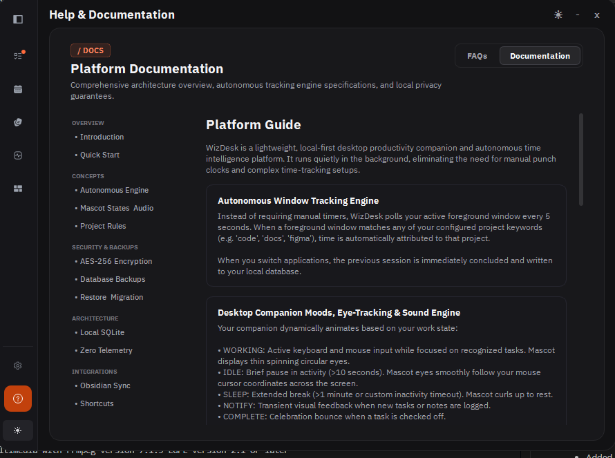
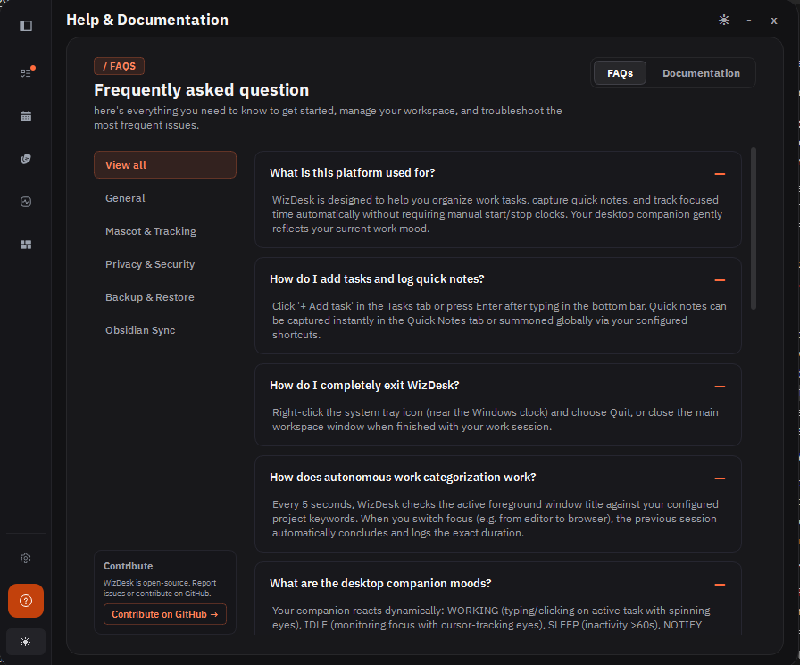
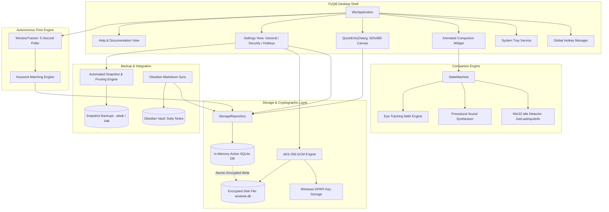
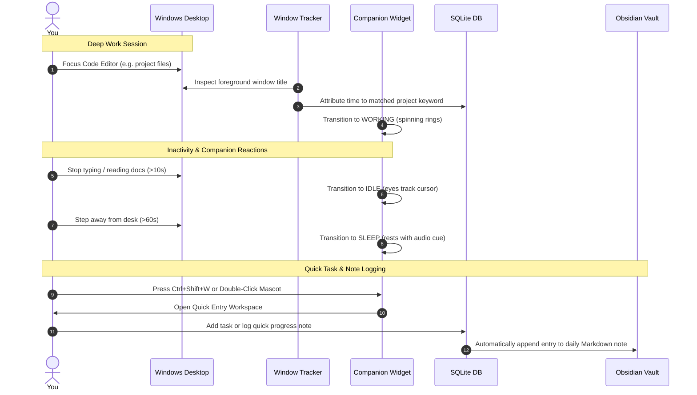

<div align="center">


# WizDesk

**A Minimalist Desktop Companion for Autonomous Work Tracking, Hierarchical Tasks, and Obsidian Markdown Sync**

[](https://www.python.org/)
[](https://www.riverbankcomputing.com/software/pyqt/)
[](https://www.microsoft.com/windows)
[](https://en.wikipedia.org/wiki/Galois/Counter_Mode)
[](https://www.sqlite.org/)
[](https://obsidian.md/)
[](LICENSE)
[](tests/)

<br />

[Workspace Preview](#workspace-preview) &bull; [Architecture](#system-architecture) &bull; [Core Workflow](#core-workflow) &bull; [Privacy & Security](#privacy-and-security) &bull; [Quickstart](#quickstart--installation) &bull; [Shortcuts](#keyboard-shortcuts--gestures) &bull; [Testing](#automated-testing)

</div>

---

## Overview

WizDesk is a lightweight, local-first productivity companion for Windows and Linux. It runs quietly on your desktop, automatically tracking time spent on active applications, providing instant task and note capture through global hotkeys and mouse gestures, and compiling your daily work into clean Markdown notes inside your Obsidian vault.

Unlike cloud-based tracking software that requires manual clocks or uploads private usage telemetry to external servers, WizDesk stores all data locally in an encrypted SQLite database on your own machine.

---

## Workspace Preview

<div align="center">



<br /><br />



</div>

---

## System Architecture

WizDesk is architected around decoupled components connected through Qt signals, an automated Win32 idle engine, and local-first cryptographic storage:



### Architectural Highlights

1. **In-Memory Execution with Encrypted Persistence**: When database encryption is active, the database is decrypted into memory upon startup. All read/write operations execute against memory with zero disk bottleneck. On shutdown and periodic intervals, the database is serialized and encrypted via AES-256-GCM before writing to disk atomically.
2. **Dynamic Companion Eye-Tracking**: In idle state, the mascot calculates trigonometry angles from its screen coordinates toward your cursor position, moving its pupils in real time across multiple monitors.
3. **Passive Polling Without Spying**: The tracker queries GetForegroundWindow every 5 seconds, reading only the window title text to associate active time with your configured project keywords. Keystrokes, screenshots, and file contents are never read or stored.

---

## Core Workflow

WizDesk is designed around an intuitive, uninterrupted workflow that eliminates manual time tracking:



### 1. Autonomous Window Tracking
Instead of pressing start and stop on a timer, WizDesk monitors your active window title every 5 seconds. If the title contains any configured keyword (such as code, docs, terminal, or figma), duration is automatically credited to that project. When you switch windows, the elapsed time concludes and writes directly to the local database.

### 2. Desktop Companion & Eye-Tracking
The desktop companion reflects your current productivity state:
- **WORKING**: Triggered by active keyboard or mouse interaction on tracked tasks. Displays spinning rings.
- **IDLE**: Triggered by 10 seconds of inactivity. Eyes smoothly follow your mouse cursor position.
- **SLEEP**: Triggered by 1 minute of inactivity. The companion rests.
- **NOTIFY**: Brief notification state when tasks or notes are logged.
- **COMPLETE**: Short animation when a task is checked off.

### 3. Integrated Workspace Canvas
Press `Ctrl+Shift+W` to summon the 920x680 workspace window:
- **Tasks View**: Segmented status filtering (Task, In Progress, Completed, Cancelled), subtasks with independent progress, inline title renaming, and priority ordering.
- **Quick Notes View**: Instant capture for reference notes, ideas, and scratchpads, categorized by project.
- **Timeline View**: Visual breakdown of your daily tracked sessions, category metrics, and total focused time.
- **Projects Dashboard**: Manage project keywords, color badges, tracked hours, and rename mappings.
- **Calendar Agenda**: Day-by-day historical view with month and year dropdown navigation.
- **Settings View**: Granular control over General preferences, Hotkeys, Database Encryption, Backups, and Obsidian Vault integration.
- **Help & Documentation**: Built-in 20-topic FAQ and platform documentation guides.

### 4. Obsidian Vault Synchronization
Under **Settings > Integrations**, select your local Obsidian vault root. WizDesk writes your completed tasks, logged notes, and window session summaries directly into your daily Markdown notes (`WizDesk Logs/YYYY-MM-DD.md`) without requiring cloud accounts or third-party plugins.

---

## Privacy and Security

WizDesk is built around verifiable privacy and robust data protection:

### Zero Telemetry & Local-First Storage
- **100% Local Storage**: All tasks, notes, sessions, and settings reside in `%APPDATA%\WizDesk\wizdesk.db` on Windows (or `~/.local/share/WizDesk/wizdesk.db` on Linux).
- **No Network Requests**: WizDesk does not send telemetry, user analytics, crash dumps, or ping remote endpoints. It operates completely air-gapped without internet access.
- **No Screen or Keystroke Logging**: The tracker only inspects the text of the active foreground window title. Keystrokes, mouse clicks, file paths, and screen contents are never captured.

### Database Encryption at Rest (AES-256-GCM)
- **Authenticated Encryption**: Enables AES-256-GCM encryption for the entire SQLite database file.
- **In-Memory Security**: When unlocked, the database resides in memory. Writes are serialized and encrypted prior to hitting the filesystem. No unencrypted temporary files are left on disk.
- **Windows DPAPI Integration**: The 256-bit encryption key is protected using the Windows Data Protection API (DPAPI), bound to your Windows user logon for seamless, prompt-free startup.
- **Master Key Recovery**: You can export and copy your 64-character master key (formatted as `WIZK-...`) in **Settings > Security** for offline backup or machine migration.

### Automated Backups & Safety Snapshots
- **Automatic Startup Snapshots**: On every application startup, WizDesk creates a timestamped point-in-time snapshot backup (`.wbak` for encrypted databases, `.bak` for standard databases).
- **On-Demand Backups**: Create instantaneous snapshots anytime with a single click in **Settings > Security**. Manual backups are permanently preserved and never automatically pruned.
- **Pruning Engine**: Set a retention limit between 1 and 30 snapshots to keep disk footprint minimal while retaining historical safety.
- **Pre-Restore Verification**: Before restoring any snapshot, WizDesk creates an emergency pre-restore safety copy and runs SQLite `PRAGMA integrity_check` to prevent corrupted data from replacing active tables.

---

## Quickstart & Installation

### Prerequisites
- **Operating System**: Windows 10, Windows 11, or Linux (X11 / Wayland)
- **Python**: Python 3.10, 3.11, 3.12, or 3.14 (64-bit)

### Installation Steps

1. **Clone the repository**:
   ```powershell
   git clone https://github.com/Lukog10/WizDesk.git
   cd WizDesk
   ```

2. **Create and activate a virtual environment**:
   ```powershell
   python -m venv .venv
   .venv\Scripts\Activate.ps1
   ```

3. **Install dependencies**:
   ```powershell
   pip install -r requirements.txt
   ```

4. **Launch WizDesk**:
   ```powershell
   python -m wiz
   ```

---

## Keyboard Shortcuts & Gestures

| Shortcut / Gesture | Scope | Action |
| :--- | :--- | :--- |
| `Ctrl + Shift + W` | System-Wide | Open or focus the main **Workspace Window** |
| `Ctrl + Shift + M` | System-Wide | Toggle companion mascot visibility (show / hide) |
| `Ctrl + Shift + T` | System-Wide | Summon floating **Quick Task Bar** |
| `Ctrl + Shift + N` | System-Wide | Summon floating **Quick Note Bar** |
| **Left Double-Click** | Mascot Widget | Pop up floating Quick Task Bar near mascot |
| **Left Triple-Click** | Mascot Widget | Pop up floating Quick Note Bar near mascot |
| **Left Click + Drag** | Mascot / Header | Reposition the companion anywhere on your desktop |
| **Right Click** | Mascot Widget | Open context menu (Workspace, Moods, Settings, Quit) |
| `Enter` | Text Inputs | Save new task, note, or commit inline rename |
| `Escape` | Windows / Modals | Close workspace window or dismiss quick entry bars |

All hotkeys are customizable under **Settings > Hotkeys**.

---

## Automated Testing

WizDesk maintains a verified test suite covering models, cryptographic operations, UI dialogs, hotkey management, backup routines, and window tracking:

```powershell
.venv\Scripts\pytest -v
```

### Verified Test Matrix (123 Tests Passing):
- `tests/test_backup.py`: Validates snapshot creation, .wbak/.bak formatting, retention pruning, pre-restore safety snapshots, and integrity validation.
- `tests/test_crypto.py`: Validates AES-256-GCM encryption, decryption, invalid key rejection, DPAPI key storage, and Master Key formatting.
- `tests/test_dialogs.py`: Validates task rows, subtasks, notes, segmented status filtering, and popover calendar navigation.
- `tests/test_mascot_core.py`: Validates state machine transitions, automated Win32 idle timeouts, and companion rendering.
- `tests/test_sound.py`: Validates procedural sound synthesizer, audio volume, and mute states.
- `tests/test_splash_screen.py`: Validates startup splash screen geometry, progress milestones, fade-out animation, and workspace loading overlay.
- `tests/test_obsidian_sync.py`: Validates Markdown parsing, log generation, and file synchronization.
- `tests/test_storage.py`: Validates SQLite schemas, queries, migrations, and keyword matching.
- `tests/test_sidebar_and_shell.py`: Validates sidebar navigation, SettingsView, HelpFaqView, accordion cards, and topic shortcuts.
- `tests/test_timeline.py`: Validates session aggregation, metrics, and timeline views.
- `tests/test_projects_dashboard.py`: Validates project keywords, colors, renames, and tracking dashboards.

---

## Building a Standalone Executable (.exe)

WizDesk includes a PyInstaller specification (`wizdesk.spec`) configured for production standalone packaging:

```powershell
pyinstaller wizdesk.spec
```

The compiled standalone executable will be written to `dist/WizDesk/WizDesk.exe` with bundled icons, fonts, and assets without requiring a local Python installation.

---

## Repository Structure

```text
WizDesk/
├── assets/                          # Vector SVGs, icons, and screenshots
│   ├── screenshots/                 # Application preview images
│   ├── sounds/                      # Procedural and sound effect assets
│   ├── fonts/                       # Bundled typography
│   ├── icons/                       # Navigation and status icons
│   ├── wiz-idle.svg                 # Mascot resting state
│   ├── wiz-working.svg              # Mascot working animation state
│   ├── wiz-notify.svg               # Mascot notification state
│   ├── wiz-complete.svg             # Mascot completion celebration state
│   ├── wiz-sleep.svg                # Mascot sleeping state
│   └── WizDesk Logo v1.jpeg         # Official logo
├── tests/                           # Complete automated pytest suite (123 tests)
│   ├── conftest.py                  # Pytest fixtures and environment setup
│   ├── test_backup.py               # Automated backup and restoration tests
│   ├── test_crypto.py               # AES-256-GCM and DPAPI security tests
│   ├── test_dialogs.py              # UI, modal, and task tests
│   ├── test_mascot_core.py          # State machine and idle engine tests
│   ├── test_obsidian_sync.py        # Markdown parser and vault sync tests
│   ├── test_projects_dashboard.py   # Projects dashboard and keyword tests
│   ├── test_sidebar_and_shell.py    # Sidebar, Settings, and Help & FAQ tests
│   ├── test_sound.py                # Audio and sound synthesizer tests
│   ├── test_splash_screen.py        # Startup splash screen and overlay tests
│   ├── test_storage.py              # SQLite storage repository tests
│   └── test_timeline.py             # Activity timeline and metric tests
├── wiz/                             # Core Python application package
│   ├── core/                        # Configuration, signals, sound, state machine
│   │   ├── config.py
│   │   ├── idle_detector.py         # Win32 GetLastInputInfo idle engine
│   │   ├── signals.py
│   │   ├── sound.py                 # Procedural audio cue synthesizer
│   │   └── state_machine.py
│   ├── storage/                     # SQLite database models, queries, and crypto
│   │   ├── backup.py                # Automated snapshot and pruning engine
│   │   ├── crypto.py                # AES-256-GCM and DPAPI encryption engine
│   │   ├── db.py                    # Database connection manager
│   │   └── models.py                # Data models and repository queries
│   ├── sync/                        # Obsidian Markdown exporter and vault sync
│   │   └── obsidian.py
│   ├── tracker/                     # Passive window activity poller (5s interval)
│   │   └── window_tracker.py
│   ├── ui/                          # PyQt6 widgets, dialogs, calendar, and shell
│   │   ├── help_faq_view.py         # Help & Platform Documentation canvas
│   │   ├── mascot_widget.py         # Mascot canvas with eye-tracking pupil math
│   │   ├── popup_dialog.py          # QuickEntryDialog 920x680 workspace shell
│   │   ├── projects_dashboard_view.py # Projects tracking dashboard
│   │   ├── settings_view.py         # Settings dialog and categories
│   │   ├── sidebar_widget.py        # Side navigation bar
│   │   ├── splash_screen.py         # Startup splash screen and workspace loading overlay
│   │   ├── timeline_view.py         # Activity log timeline
│   │   └── tray_icon.py             # System tray service
│   ├── utils/                       # Global hotkey listeners
│   │   └── hotkey.py
│   ├── __init__.py
│   └── __main__.py                  # Application entry point
├── pyproject.toml                   # Project metadata and pytest configuration
├── requirements.txt                 # Runtime dependencies
├── Wiz-PRD.md                       # Product Requirements Document
├── AGENTS.md                        # Coding agent guidelines and execution rules
└── README.md                        # Polished open source documentation
```

---

## Contributing

Contributions, bug reports, and suggestions are welcome:

1. Fork the repository.
2. Create a topic branch: `git checkout -b feature/my-feature`.
3. Commit your changes: `git commit -m "feat: add feature"`.
4. Ensure all tests pass: `pytest`.
5. Open a Pull Request on GitHub.

---

## License & Attribution

Distributed under the **GNU General Public License v3 (GPL v3)**. See [LICENSE](LICENSE) and [THIRD_PARTY_LICENSES.md](THIRD_PARTY_LICENSES.md) for details.

Created and designed by **Gokul R** &bull; [GitHub Profile](https://github.com/Lukog10)