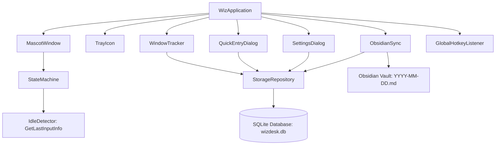

<div align="center">


# WizDesk

**A Minimalist Desktop Companion for Work Tracking, Hierarchical Tasks, and Obsidian Markdown Sync**

[](https://www.python.org/)
[](https://www.riverbankcomputing.com/software/pyqt/)
[](https://www.microsoft.com/windows)
[](https://www.sqlite.org/)
[](https://obsidian.md/)
[](LICENSE)
[](tests/)

<br />

[Quickstart](#quickstart--installation) &bull; [Key Capabilities](#key-capabilities) &bull; [Mascot Behavior](#1-floating-mascot-companion--automated-idle-engine) &bull; [Obsidian Sync](#6-real-time--automatic-obsidian-daily-sync) &bull; [Settings](#configuration--settings) &bull; [Testing](#automated-verification--testing)

</div>

---

## Table of Contents

- [Product Introduction](#product-introduction)
- [Product Overview & User Experience](#product-overview--user-experience)
- [Key Capabilities](#key-capabilities)
  - [1. Floating Mascot Companion & Automated Idle Engine](#1-floating-mascot-companion--automated-idle-engine)
  - [2. Calendar Date Navigation & Historical Isolation](#2-calendar-date-navigation--historical-isolation)
  - [3. Hierarchical Tasks, Subtasks & Status Dropdowns](#3-hierarchical-tasks-subtasks--status-dropdowns)
  - [4. Inline Renaming & Compact Timestamp Ranges](#4-inline-renaming--compact-timestamp-ranges)
  - [5. Quick Progress Notes & Section Management](#5-quick-progress-notes--section-management)
  - [6. Real-Time & Automatic Obsidian Daily Sync](#6-real-time--automatic-obsidian-daily-sync)
  - [7. Passive Window & Context Activity Tracker](#7-passive-window--context-activity-tracker)
- [Architecture & Design System](#architecture--design-system)
  - [System Architecture](#system-architecture)
  - [UI Design System Primitives](#ui-design-system-primitives)
- [Quickstart & Installation](#quickstart--installation)
  - [Prerequisites](#prerequisites)
  - [Installation Steps](#installation-steps)
  - [Running the Application](#running-the-application)
- [Keyboard Shortcuts & Hotkeys](#keyboard-shortcuts--hotkeys)
- [Configuration & Settings](#configuration--settings)
- [Automated Verification & Testing](#automated-verification--testing)
- [Repository Structure](#repository-structure)
- [Roadmap](#roadmap)
- [License & Credits](#license--credits)

---

## Product Introduction

**WizDesk** is a lightweight, privacy-first desktop companion for Windows engineered to streamline daily productivity, task management, and personal knowledge synchronisation.

Traditional project management tools often interrupt deep work with heavyweight interfaces and slow loading times. WizDesk lives quietly on your screen as an animated companion mascot, passively logs your active applications in the background every 5 minutes, captures structured tasks and quick notes in under two seconds via global hotkeys, and compiles your entire day into clean Markdown entries directly inside your **Obsidian Vault**.

---

## Product Overview & User Experience

WizDesk combines a minimal ambient presence with an interface engineered around keyboard-first interactions:

1. **Ambient Companion**: A frameless, transparent ghost mascot that sits unobtrusively above your active windows with smooth floating breathing animations. It responds dynamically to your real-time input and system idle state (`idle`, `working`, `notify`, `complete`, and `sleep`).
2. **Workspace Window**: A clean card-based workspace featuring a segmented view switcher between **Tasks** and **Quick Notes**, interactive calendar date navigation, status dropdowns, expandable project groups, and dedicated section selectors.
3. **Local-First SQLite Storage**: All logs, tasks, and notes are indexed locally in a structured SQLite database (`wizdesk.db`) with zero external network dependencies.
4. **Real-Time Markdown Export**: Direct, live synchronization to Obsidian daily notes whenever work is created or updated.

---

## Key Capabilities

### 1. Floating Mascot Companion & Automated Idle Engine
- **Frameless and Draggable**: Freely position the companion anywhere across multiple monitors with automatic coordinate persistence.
- **Automated Win32 Idle Engine**: Powered by Windows `GetLastInputInfo` measuring system-wide keyboard and mouse inactivity with zero performance overhead:
  - **Active Typing / Mouse Movement** &rarr; Wiz enters `WORKING` (focused animation).
  - **10 Seconds Inactivity** &rarr; Wiz enters `IDLE` (calm resting state).
  - **60 Seconds Inactivity** &rarr; Wiz enters `SLEEP` (sleepy half-lids).
  - **Adding Task / Subtask** &rarr; Wiz enters `NOTIFY` (wide eyes for 3.5s).
  - **Completing / Cancelling Task** &rarr; Wiz enters `COMPLETE` (celebration smile for 3.5s).
- **Context Menu & Controls**: Right-click the mascot to manually switch states, trigger Obsidian sync, open settings, or hide the widget.

### 2. Calendar Date Navigation & Historical Isolation
- **Day-by-Day Isolation**: Today's tasks are exclusively shown for today. Past work is neatly filed under its respective creation date.
- **Interactive Date Picker**: Click `<` and `>` to browse previous days or click the date title to open an interactive popover calendar widget.

### 3. Hierarchical Tasks, Subtasks & Status Dropdowns
- **Status Dropdowns**: Change task status directly via an inline combobox (`Task`, `In progress`, `Completed`, `Cancelled`) with color-coded status badges.
- **Parent Tasks & Subtasks**: Break down complex work items into structured subtasks with dedicated completion tracking.
- **Decoupled Completion Logic**: Marking individual subtasks as done tracks their state independently without prematurely closing the parent task.
- **4-Stage Segmented Filter**: Filter tasks instantly with capsule tabs:
  - `Task`: Active items awaiting action.
  - `In progress`: Real-time view of ongoing tasks.
  - `Completed`: Archived log of finished work items.
  - `Cancelled`: Discarded tasks maintained for historical context.

### 4. Inline Renaming & Compact Timestamp Ranges
- **Inline Renaming**: Double-click or right-click any task or subtask to rename it inline. Press `Enter` to commit or `Escape` to cancel.
- **Compact Time Ranges**: Clean parenthetical timestamps without unnecessary text prefixes:
  - Active: `(1:36 PM)`
  - Completed / Cancelled: `(1:36 PM - 1:57 PM)`
- Timestamps are placed neatly below the title to avoid edge cutoffs on long task names.

### 5. Quick Progress Notes & Section Management
- **Frictionless Capture**: Log quick thoughts, daily blockers, and technical decisions directly into the timeline.
- **Custom Section Creation**: Create new project sections on the fly using WizDesk's frameless modal dialog (`CreateSectionDialog`).
- **Interactive Section Badges**: Click any section tag (e.g. `[Work]`, `[Personal Projects]`) or right-click the row to relocate notes between projects.

### 6. Real-Time & Automatic Obsidian Daily Sync
- **Live Markdown Syncing**: Automatically updates your daily markdown note (`WizDesk Logs/YYYY-MM-DD.md`) in your Obsidian vault whenever tasks or notes are added, edited, or checked off.
- **Periodic & Shutdown Flush**: Flushes activity summaries every 5 minutes and on application exit.
- **Vault Formatting Preview**:

```markdown
## 2026-09-01

### Tasks
- [x] Finalize landing page wireframes (Work)
  - [x] Design desktop hero mockup
  - [x] Design mobile responsiveness layout
- [~] Conduct user testing on prototypes (Work)
- [ ] Explore motion interaction ideas (Work)

### Auto-tracked
- 09:00-09:05 - Code (popup_dialog.py - Wiz)
- 09:05-09:10 - Obsidian (Daily Notes - Vault)

### Notes
- [x] [Work] Investigated background window polling performance (09:15)
- [ ] [Work] Drafted initial system architecture (14:30)
```

### 7. Passive Window & Context Activity Tracker
- **Background Activity Poller**: Samples active window titles and process names every 5 minutes via Windows Win32 APIs.
- **Automatic Project Tagging**: Matches window titles against customizable project keywords configured in SQLite.
- **Privacy-First**: Records window titles and durations without logging keystrokes or screen captures.

---

## Architecture & Design System

### System Architecture



### UI Design System Primitives

| Property | Design Token | Usage |
| :--- | :--- | :--- |
| **Primary Canvas** | `#FFFFFF` | Inner workspace cards, task containers, modal cards |
| **Outer Window Frame** | `#E6E6EA` | Frameless window container with 24px rounded corners |
| **Border Tone** | `#D8D8DE` / `#ECECEF` | Card outlines and subtle division rules |
| **Input Surface** | `#F4F4F5` | Quick-add line inputs and section combobox fields |
| **Primary Typography** | `Inter, Segoe UI, sans-serif` | Clean body copy, buttons, headers |
| **Monospace Typography** | `JetBrains Mono, monospace` | Timestamps, section tags, calendar headers |
| **Accent Colors** | `#18181B` / `#2563EB` | Primary action buttons and section tag highlights |
| **Drop Shadows** | `QGraphicsDropShadowEffect (28px blur)` | Window depth and elevated modal dialogs |

---

## Quickstart & Installation

### Prerequisites
- **Operating System**: Windows 10 or Windows 11 (64-bit)
- **Python**: Python 3.10, 3.11, 3.12, or 3.14

### Installation Steps

1. **Clone the repository**:
   ```bash
   git clone https://github.com/Lukog10/WizDesk.git
   cd WizDesk
   ```

2. **Create and activate a virtual environment**:
   ```powershell
   python -m venv .venv
   .venv\Scripts\Activate.ps1
   ```

3. **Install project dependencies**:
   ```bash
   pip install -r requirements.txt
   ```

### Running the Application

Launch WizDesk directly via the Python module:
```bash
python -m wiz
```

---

## Keyboard Shortcuts & Hotkeys

| Shortcut | Scope | Description |
| :--- | :--- | :--- |
| `Ctrl + Shift + W` | Global (System-Wide) | Open or focus the WizDesk Workspace dialog |
| `Enter` | Workspace Dialog | Submit and save a new task, note, or renamed title |
| `Escape` | Workspace / Modals | Close dialog or cancel inline editing |
| `Double Click` | Mascot Widget | Open the Workspace dialog |
| `Double Click` | Task / Subtask Title | Inline rename task or subtask |
| `Left Click + Drag` | Mascot / Title Bar | Move the frameless window across the desktop |
| `Right Click` | Mascot / Task / Subtask / Tray | Open context menus for status, renaming, and settings |

---

## Configuration & Settings

WizDesk maintains persistent settings and application data in standard Windows application directories:

- **Configuration File**: `%APPDATA%\WizDesk\config.json`
- **Database File**: `%APPDATA%\WizDesk\wizdesk.db`
- **Logs Directory**: Configurable via Settings Dialog (Defaults to `/WizDesk Logs/` in your Obsidian vault)

### Settings Dialog Options:
- **Obsidian Vault Path**: Directory browser for linking your local Obsidian vault root.
- **Auto-Tracking Interval**: Configurable polling timer (Default: Every 5 minutes).
- **Animation Toggle**: Enable or disable the floating bob animation for the mascot.
- **Project Keyword Rules**: Configure keyword associations for automatic process classification.

---

## Automated Verification & Testing

WizDesk features a comprehensive automated test suite powered by `pytest` and `pytest-qt`:

```bash
.venv\Scripts\pytest.exe -v
```

### Verified Test Matrix (25 Tests Passing):
- `test_dialogs.py`: Validates task flows, subtasks, note creation, section changes, checkboxes, calendar navigation, status dropdowns, inline renaming, timestamps, custom modals, settings, and SVG rendering.
- `test_mascot_core.py`: Verifies state machine transitions, automated Win32 idle and sleep transitions, configuration defaults, tray icon initialization, and mascot rendering.
- `test_obsidian_sync.py`: Tests Markdown parsing, daily log generation, and file synchronization routines.
- `test_storage.py`: Tests session tracking, hierarchical task queries, subtask status updates, task renaming, timestamps, note persistence, and keyword matching.

---

## Repository Structure

```text
WizDesk/
├── assets/                          # Vector SVGs, icons, and brand assets
│   ├── idle.svg                     # Primary favicon asset
│   ├── wiz-idle.svg                 # Mascot resting state
│   ├── wiz-working.svg              # Mascot working animation state
│   ├── wiz-notify.svg               # Mascot notification state
│   ├── wiz-complete.svg             # Mascot completion celebration state
│   ├── wiz-sleep.svg                # Mascot sleeping state
│   ├── WizDesk Logo v1.jpeg         # Official WizDesk Logo (v1)
│   └── WizDesk Logo v2.jpeg         # Official WizDesk Logo (v2)
├── tests/                           # Automated pytest suite (25 tests)
│   ├── conftest.py                  # Pytest configuration & environment fixtures
│   ├── test_dialogs.py              # UI, modal, calendar, and task row unit tests
│   ├── test_mascot_core.py          # State machine and idle engine tests
│   ├── test_obsidian_sync.py        # Markdown parser and vault sync tests
│   └── test_storage.py              # SQLite storage repository tests
├── wiz/                             # Core Python application package
│   ├── core/                        # Configuration, signals, state machine, and idle detector
│   │   ├── config.py
│   │   ├── idle_detector.py         # Win32 GetLastInputInfo idle engine
│   │   ├── signals.py
│   │   └── state_machine.py
│   ├── storage/                     # SQLite database models and queries
│   │   ├── db.py
│   │   └── models.py
│   ├── sync/                        # Obsidian Markdown exporter & real-time sync
│   │   └── obsidian.py
│   ├── tracker/                     # Windows activity poller (5-min interval)
│   │   └── window_tracker.py
│   ├── ui/                          # PyQt6 widgets, dialogs, calendar, and icons
│   │   ├── icons.py
│   │   ├── mascot_widget.py
│   │   ├── mascot_window.py
│   │   ├── popup_dialog.py
│   │   ├── settings_dialog.py
│   │   └── tray_icon.py
│   ├── utils/                       # Global hotkey listeners
│   │   └── hotkey.py
│   ├── __init__.py
│   └── __main__.py                  # Application entry point
├── pyproject.toml                   # Project metadata and pytest configuration
├── requirements.txt                 # Runtime dependencies
├── Wiz-PRD.md                       # Comprehensive Product Requirements Document
├── context.md                       # System architecture and knowledge baseline
└── README.md                        # Project documentation
```

---

## Roadmap

- [x] Floating mascot widget with animated states & Win32 automated idle engine
- [x] Minimalist task hierarchy with subtasks and decoupled completion
- [x] Calendar date navigation & historical day isolation
- [x] Task status dropdowns (`Task`, `In progress`, `Completed`, `Cancelled`)
- [x] Inline task & subtask renaming (double-click or context menu)
- [x] Compact timestamp ranges (`start - end`)
- [x] 5-minute passive window tracking & real-time Obsidian daily note sync
- [x] Quick progress notes with interactive section changing
- [x] Custom frameless section modal dialog
- [x] Multi-resolution SVG favicon and application icons
- [ ] Dedicated **Log Activity** timeline view with historical heatmaps
- [ ] Dedicated **Project Tracking** dashboard
- [ ] Standalone single-file Windows executable packaging (`.exe`)

---

## License & Credits

Distributed under the **MIT License**. See `LICENSE` for more information.

Created and designed by **Gokul R** &bull; [GitHub Profile](https://github.com/Lukog10)