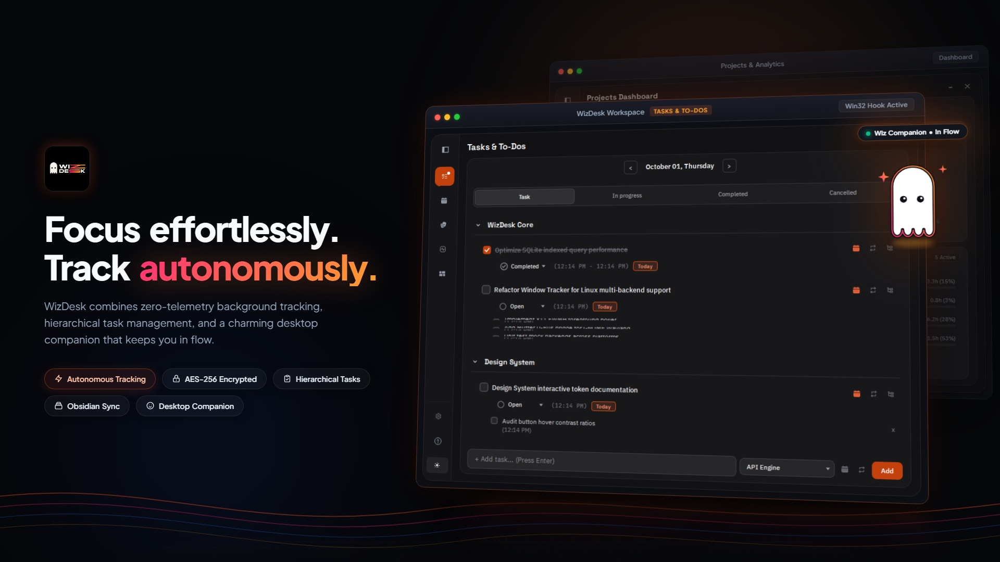
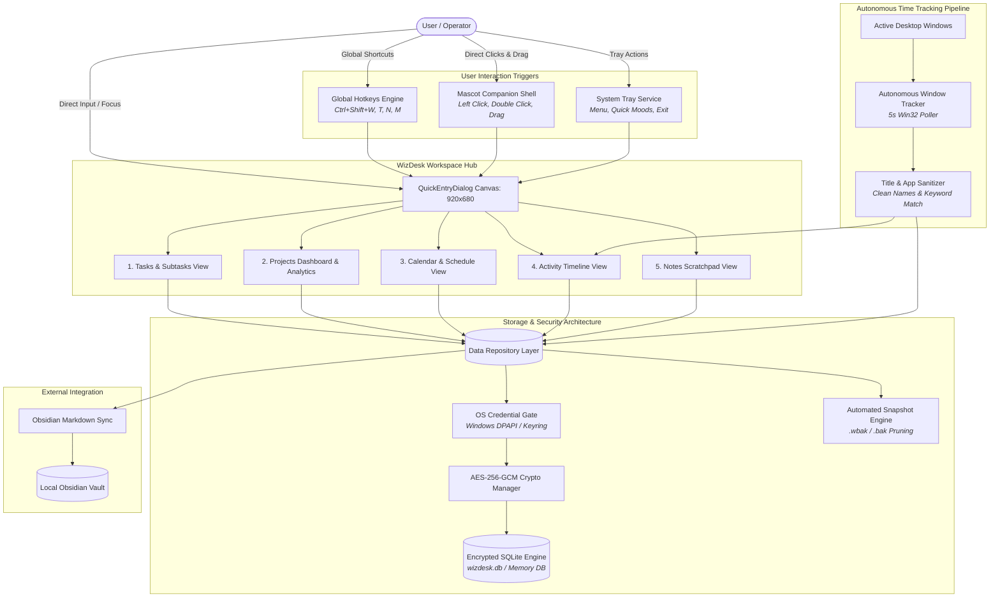
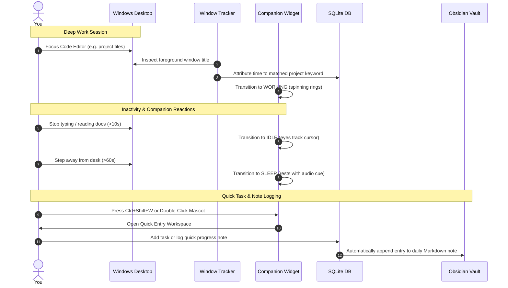

<div align="center">



<br /><br />

# WizDesk

**A Minimalist Desktop Companion for Autonomous Work Tracking, Hierarchical Tasks, and Obsidian Markdown Sync**

[](https://www.python.org/)
[](https://www.riverbankcomputing.com/software/pyqt/)
[](https://www.microsoft.com/windows)
[](https://en.wikipedia.org/wiki/Galois/Counter_Mode)
[](https://www.sqlite.org/)
[](https://obsidian.md/)
[](LICENSE)
[](tests/)

<br />

[Overview](#overview) &bull; [System Design](#system-design) &bull; [Interactive Map](docs/wizdesk-interactive-map.html) &bull; [Codebase Guide](docs/CODEBASE_ARCHITECTURE.md) &bull; [Core Workflow](#core-workflow) &bull; [Privacy & Security](#privacy-and-security) &bull; [Download](#download--quickstart) &bull; [Contributing](#contributing)

</div>

---

## Overview

WizDesk is a lightweight, local-first productivity companion for Windows and Linux. It runs quietly on your desktop, automatically tracking time spent on active applications, providing instant task and note capture through global hotkeys and mouse gestures, and compiling your daily work into clean Markdown notes inside your Obsidian vault.

Unlike cloud-based tracking software that requires manual clocks or uploads private usage telemetry to external servers, WizDesk stores all data locally in an encrypted SQLite database on your own machine.

---

---

## System Design

> For interactive architectural exploration with live subsystem inspection, node highlights, and code maps, open the standalone [WizDesk Interactive System Map](docs/wizdesk-interactive-map.html) and view the detailed [Codebase Architecture Specification](docs/CODEBASE_ARCHITECTURE.md).

WizDesk is engineered around an event-driven desktop shell, decoupled interaction triggers, an autonomous background tracking pipeline, and a local-first cryptographic storage architecture:


```mermaid
graph TD
    USER([User / Operator])

    subgraph Triggers [User Interaction Triggers]
        HOTKEYS[Global Hotkeys Engine<br><i>Ctrl+Shift+W, T, N, M</i>]
        MASCOT[Mascot Companion Shell<br><i>Left Click, Double Click, Drag</i>]
        TRAY[System Tray Service<br><i>Menu, Quick Moods, Exit</i>]
    end

    subgraph Hub [WizDesk Workspace Hub]
        WORKSPACE[QuickEntryDialog Canvas: 920x680]
        VIEW_TASKS[1. Tasks & Subtasks View]
        VIEW_DASH[2. Projects Dashboard & Analytics]
        VIEW_CAL[3. Calendar & Schedule View]
        VIEW_TIMELINE[4. Activity Timeline View]
        VIEW_NOTES[5. Notes Scratchpad View]
    end

    subgraph Tracking_Pipeline [Autonomous Time Tracking Pipeline]
        ACTIVE_WIN[Active Desktop Windows]
        POLLER[Autonomous Window Tracker<br><i>5s Win32 Poller</i>]
        SANITIZER[Title & App Sanitizer<br><i>Clean Names & Keyword Match</i>]
    end

    subgraph Storage_Pipeline [Storage & Security Architecture]
        REPO[(Data Repository Layer)]
        GATE[OS Credential Gate<br><i>Windows DPAPI / Keyring</i>]
        CRYPTO[AES-256-GCM Crypto Manager]
        SQLITE[(Encrypted SQLite Engine<br><i>wizdesk.db / Memory DB</i>)]
        BACKUP[Automated Snapshot Engine<br><i>.wbak / .bak Pruning</i>]
    end

    subgraph Sync_Integration [External Integration]
        OBSIDIAN[Obsidian Markdown Sync]
        VAULT[(Local Obsidian Vault)]
    end

    USER -->|Global Shortcuts| HOTKEYS
    USER -->|Direct Clicks & Drag| MASCOT
    USER -->|Tray Actions| TRAY
    USER -->|Direct Input / Focus| WORKSPACE

    HOTKEYS --> WORKSPACE
    MASCOT --> WORKSPACE
    TRAY --> WORKSPACE

    WORKSPACE --> VIEW_TASKS
    WORKSPACE --> VIEW_DASH
    WORKSPACE --> VIEW_CAL
    WORKSPACE --> VIEW_TIMELINE
    WORKSPACE --> VIEW_NOTES

    VIEW_TASKS --> REPO
    VIEW_DASH --> REPO
    VIEW_CAL --> REPO
    VIEW_TIMELINE --> REPO
    VIEW_NOTES --> REPO

    ACTIVE_WIN --> POLLER
    POLLER --> SANITIZER
    SANITIZER --> VIEW_TIMELINE
    SANITIZER --> REPO

    REPO --> GATE
    GATE --> CRYPTO
    CRYPTO --> SQLITE
    REPO --> BACKUP

    REPO --> OBSIDIAN
    OBSIDIAN --> VAULT
```

### System Architecture Breakdown

#### 1. User Triggers & Workspace Shell
- **Global Hotkey Manager**: Listens system-wide via OS hooks (`pynput`) for instant summoning (`Ctrl+Shift+W` for Workspace Hub, `Ctrl+Shift+T` for Quick Task, `Ctrl+Shift+N` for Quick Note, `Ctrl+Shift+M` for Mascot toggle).
- **Desktop Companion Mascot**: Always-on-top frameless floating companion with real-time trigonometry pupil math tracking your cursor, sound synthesizer reactions, and gestures (click to interact, double-click to summon workspace, drag to reposition).
- **System Tray Service**: Background daemon providing quick mood controls, workspace shortcuts, and graceful termination.
- **WizDesk Workspace Hub**: Central 920x680 PyQt6 hub housing 5 dedicated productivity views:
  1. **Tasks View**: Hierarchical parent-child task management, subtask progress calculation, segmented status filtering, and inline priority edits.
  2. **Projects Dashboard**: Time analytics, app distribution donut chart, multi-project comparison bar charts, and keyword color management.
  3. **Calendar View**: Day and week schedule visualization with historical date dropdowns.
  4. **Activity Timeline**: Chronological aggregation of active application sessions with clean process titles.
  5. **Notes View**: Project-bound markdown notes, instant scratchpad captures, and search indexing.

#### 2. Autonomous Tracking & Sanitization Pipeline
- **Passive Poller**: Queries `GetForegroundWindow` / `GetWindowTextW` every 5 seconds on Windows without intercepting user keystrokes, clipboard, or screen pixels.
- **Title & App Sanitizer**: Normalizes raw process names (e.g. `Code.exe` -> `VS Code`), strips sensitive browser tabs/URLs, extracts project keywords, and credits focused time directly into the repository layer.
- **Activity Timeline Sync**: Streams real-time aggregated session blocks into the timeline view for live inspection.

#### 3. Cryptographic Storage & Snapshot Engine
- **Decoupled Repository**: Individual views and tracker pipelines interact with an abstract `StorageRepository` interface.
- **OS Credential Gate**: Protects encryption master keys using Windows Data Protection API (DPAPI) bound to the current Windows user login session, ensuring secure unlocking with zero plaintext passwords.
- **AES-256-GCM Engine**: High-performance authenticated encryption layer. On startup, the encrypted database is decrypted into memory for microsecond read/write execution; on shutdown or timer intervals, atomic encrypted serialization writes back to `%APPDATA%\WizDesk\wizdesk.db`.
- **Snapshot & Pruning Engine**: Automatic pre-startup backups (`.wbak` / `.bak`), point-in-time on-demand snapshots, and retention pruning with pre-restore SQLite integrity checks.

#### 4. Obsidian Markdown Vault Sync
- Bidirectional synchronization engine that serializes daily task checkoffs, project notes, and session logs into your local Obsidian vault (`WizDesk Logs/YYYY-MM-DD.md`) with zero network dependencies.

---

## Core Workflow

WizDesk is designed around an intuitive, uninterrupted workflow that eliminates manual time tracking:


```mermaid
sequenceDiagram
    autonumber
    actor User as You
    participant Win as Windows Desktop
    participant Track as Window Tracker
    participant Mascot as Companion Widget
    participant DB as SQLite DB
    participant Obs as Obsidian Vault

    Note over User,Win: Deep Work Session
    User->>Win: Focus Code Editor (e.g. project files)
    Track->>Win: Inspect foreground window title
    Track->>DB: Attribute time to matched project keyword
    Mascot->>Mascot: Transition to WORKING (spinning rings)

    Note over User,Mascot: Inactivity & Companion Reactions
    User->>Win: Stop typing / reading docs (>10s)
    Mascot->>Mascot: Transition to IDLE (eyes track cursor)
    User->>Win: Step away from desk (>60s)
    Mascot->>Mascot: Transition to SLEEP (rests with audio cue)

    Note over User,Obs: Quick Task & Note Logging
    User->>Mascot: Press Ctrl+Shift+W or Double-Click Mascot
    Mascot->>User: Open Quick Entry Workspace
    User->>DB: Add task or log quick progress note
    DB->>Obs: Automatically append entry to daily Markdown note
```

### 1. Autonomous Window Tracking
Instead of pressing start and stop on a timer, WizDesk monitors your active window title every 5 seconds. If the title contains any configured keyword (such as code, docs, terminal, or figma), duration is automatically credited to that project. When you switch windows, the elapsed time concludes and writes directly to the local database.

### 2. Desktop Companion & Eye-Tracking
The desktop companion reflects your current productivity state:
- **WORKING**: Triggered by active keyboard or mouse interaction on tracked tasks. Displays spinning rings.
- **IDLE**: Triggered by 10 seconds of inactivity. Eyes smoothly follow your mouse cursor position.
- **SLEEP**: Triggered by 1 minute of inactivity. The companion rests.
- **NOTIFY**: Brief notification state when tasks or notes are logged.
- **COMPLETE**: Short animation when a task is checked off.

### 3. Integrated Workspace Canvas
Press `Ctrl+Shift+W` to summon the 920x680 workspace window:
- **Tasks View**: Segmented status filtering (Task, In Progress, Completed, Cancelled), subtasks with independent progress, inline title renaming, and priority ordering.
- **Quick Notes View**: Instant capture for reference notes, ideas, and scratchpads, categorized by project.
- **Timeline View**: Visual breakdown of your daily tracked sessions, category metrics, and total focused time.
- **Projects Dashboard**: Manage project keywords, color badges, tracked hours, and rename mappings.
- **Calendar Agenda**: Day-by-day historical view with month and year dropdown navigation.
- **Settings View**: Granular control over General preferences, Hotkeys, Database Encryption, Backups, and Obsidian Vault integration.
- **Help & Documentation**: Built-in 20-topic FAQ and platform documentation guides.

### 4. Obsidian Vault Synchronization
Under **Settings > Integrations**, select your local Obsidian vault root. WizDesk writes your completed tasks, logged notes, and window session summaries directly into your daily Markdown notes (`WizDesk Logs/YYYY-MM-DD.md`) without requiring cloud accounts or third-party plugins.

---

## Privacy and Security

WizDesk is built around verifiable privacy and robust data protection:

### Zero Telemetry & Local-First Storage
- **100% Local Storage**: All tasks, notes, sessions, and settings reside in `%APPDATA%\WizDesk\wizdesk.db` on Windows (or `~/.local/share/WizDesk/wizdesk.db` on Linux).
- **No Network Requests**: WizDesk does not send telemetry, user analytics, crash dumps, or ping remote endpoints. It operates completely air-gapped without internet access.
- **No Screen or Keystroke Logging**: The tracker only inspects the text of the active foreground window title. Keystrokes, mouse clicks, file paths, and screen contents are never captured.

### Database Encryption at Rest (AES-256-GCM)
- **Authenticated Encryption**: Enables AES-256-GCM encryption for the entire SQLite database file.
- **In-Memory Security**: When unlocked, the database resides in memory. Writes are serialized and encrypted prior to hitting the filesystem. No unencrypted temporary files are left on disk.
- **Windows DPAPI Integration**: The 256-bit encryption key is protected using the Windows Data Protection API (DPAPI), bound to your Windows user logon for seamless, prompt-free startup.
- **Master Key Recovery**: You can export and copy your 64-character master key (formatted as `WIZK-...`) in **Settings > Security** for offline backup or machine migration.

### Automated Backups & Safety Snapshots
- **Automatic Startup Snapshots**: On every application startup, WizDesk creates a timestamped point-in-time snapshot backup (`.wbak` for encrypted databases, `.bak` for standard databases).
- **On-Demand Backups**: Create instantaneous snapshots anytime with a single click in **Settings > Security**. Manual backups are permanently preserved and never automatically pruned.
- **Pruning Engine**: Set a retention limit between 1 and 30 snapshots to keep disk footprint minimal while retaining historical safety.
- **Pre-Restore Verification**: Before restoring any snapshot, WizDesk creates an emergency pre-restore safety copy and runs SQLite `PRAGMA integrity_check` to prevent corrupted data from replacing active tables.

---

## Download & Quickstart

### Download Standalone Executable (Windows)

Download the latest pre-built Windows bundle from [Releases](https://github.com/Lukog10/WizDesk/releases/latest):
* **[WizDesk-v1.1.0-windows-x64.zip](https://github.com/Lukog10/WizDesk/releases/download/v1.1.0/WizDesk-v1.1.0-windows-x64.zip)**: Download, extract, and launch `WizDesk.exe`. No Python setup required.

---

### Running from Source

#### Prerequisites
- **Operating System**: Windows 10, Windows 11, or Linux (X11 / Wayland)
- **Python**: Python 3.10, 3.11, 3.12, or 3.14 (64-bit)

#### Installation Steps

1. **Clone the repository**:
   ```powershell
   git clone https://github.com/Lukog10/WizDesk.git
   cd WizDesk
   ```

2. **Create and activate a virtual environment**:
   ```powershell
   python -m venv .venv
   .venv\Scripts\Activate.ps1
   ```

3. **Install dependencies**:
   ```powershell
   pip install -r requirements.txt
   ```

4. **Launch WizDesk**:
   ```powershell
   python -m wiz
   ```

---

## Repository Structure

```text
WizDesk/
├── assets/                          # Vector SVGs, icons, and screenshots
│   ├── screenshots/                 # Application preview images
│   ├── sounds/                      # Procedural and sound effect assets
│   ├── fonts/                       # Bundled typography
│   ├── icons/                       # Navigation and status icons
│   ├── wiz-idle.svg                 # Mascot resting state
│   ├── wiz-working.svg              # Mascot working animation state
│   ├── wiz-notify.svg               # Mascot notification state
│   ├── wiz-complete.svg             # Mascot completion celebration state
│   ├── wiz-sleep.svg                # Mascot sleeping state
│   └── WizDesk Logo v1.jpeg         # Official logo
├── tests/                           # Complete automated pytest suite (143 tests)
│   ├── conftest.py                  # Pytest fixtures and environment setup
│   ├── test_backup.py               # Automated backup and restoration tests
│   ├── test_crypto.py               # AES-256-GCM and DPAPI security tests
│   ├── test_dialogs.py              # UI, modal, and task tests
│   ├── test_mascot_core.py          # State machine and idle engine tests
│   ├── test_obsidian_sync.py        # Markdown parser and vault sync tests
│   ├── test_projects_dashboard.py   # Projects dashboard and keyword tests
│   ├── test_sidebar_and_shell.py    # Sidebar, Settings, and Help & FAQ tests
│   ├── test_sound.py                # Audio and sound synthesizer tests
│   ├── test_storage.py              # SQLite storage repository tests
│   └── test_timeline.py             # Activity timeline and metric tests
├── wiz/                             # Core Python application package
│   ├── core/                        # Configuration, signals, sound, state machine
│   │   ├── config.py
│   │   ├── idle_detector.py         # Win32 GetLastInputInfo idle engine
│   │   ├── signals.py
│   │   ├── sound.py                 # Procedural audio cue synthesizer
│   │   └── state_machine.py
│   ├── storage/                     # SQLite database models, queries, and crypto
│   │   ├── backup.py                # Automated snapshot and pruning engine
│   │   ├── crypto.py                # AES-256-GCM and DPAPI encryption engine
│   │   ├── db.py                    # Database connection manager
│   │   └── models.py                # Data models and repository queries
│   ├── sync/                        # Obsidian Markdown exporter and vault sync
│   │   └── obsidian.py
│   ├── tracker/                     # Passive window activity poller (5s interval)
│   │   └── window_tracker.py
│   ├── ui/                          # PyQt6 widgets, dialogs, calendar, and shell
│   │   ├── help_faq_view.py         # Help & Platform Documentation canvas
│   │   ├── mascot_widget.py         # Mascot canvas with eye-tracking pupil math
│   │   ├── popup_dialog.py          # QuickEntryDialog 920x680 workspace shell
│   │   ├── projects_dashboard_view.py # Projects tracking dashboard
│   │   ├── settings_view.py         # Settings dialog and categories
│   │   ├── sidebar_widget.py        # Side navigation bar
│   │   ├── timeline_view.py         # Activity log timeline
│   │   └── tray_icon.py             # System tray service
│   ├── utils/                       # Global hotkey listeners
│   │   └── hotkey.py
│   ├── __init__.py
│   └── __main__.py                  # Application entry point
├── pyproject.toml                   # Project metadata and pytest configuration
├── requirements.txt                 # Runtime dependencies
├── Wiz-PRD.md                       # Product Requirements Document
├── AGENTS.md                        # Coding agent guidelines and execution rules
└── README.md                        # Polished open source documentation
```

---

## Contributing

Contributions, bug reports, and suggestions are welcome:

1. Fork the repository.
2. Create a topic branch: `git checkout -b feature/my-feature`.
3. Commit your changes: `git commit -m "feat: add feature"`.
4. Ensure all tests pass: `pytest`.
5. Open a Pull Request on GitHub.

---

## License & Attribution

Distributed under the **GNU General Public License v3 (GPL v3)**. See [LICENSE](LICENSE) and [THIRD_PARTY_LICENSES.md](THIRD_PARTY_LICENSES.md) for details.

Created and designed by **Gokul R** &bull; [GitHub Profile](https://github.com/Lukog10)