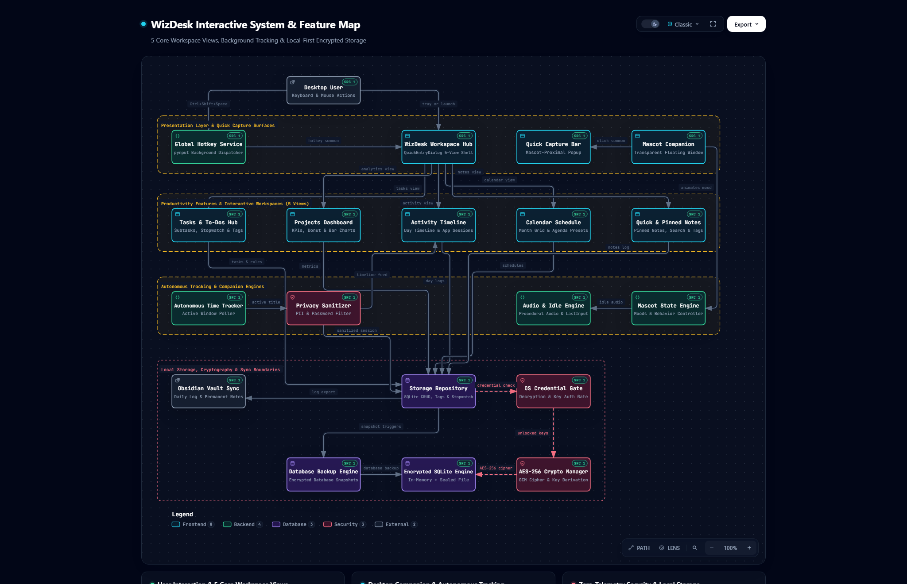
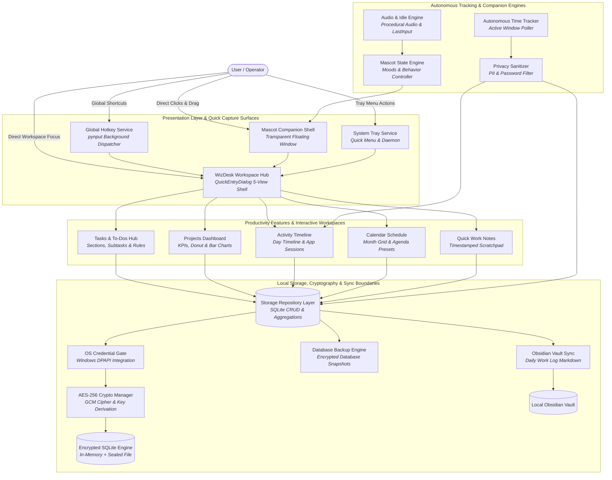

<div align="center">

<a href="https://github.com/Lukog10/WizDesk">
  
</a>


# WizDesk

**A Minimalist Desktop Companion for Autonomous Work Tracking, Hierarchical Tasks, and Obsidian Markdown Sync**

[](https://www.python.org/)
[](https://www.riverbankcomputing.com/software/pyqt/)
[](https://www.microsoft.com/windows)
[](https://en.wikipedia.org/wiki/Galois/Counter_Mode)
[](https://www.sqlite.org/)
[](https://obsidian.md/)
[](LICENSE)
[](tests/)

<br />

[Overview](#overview) &bull; [Core Features and Functions](#core-features-and-functions) &bull; [System Design or Architecture](#system-design-or-architecture) &bull; [Interactive Map](docs/wizdesk-interactive-map.html) &bull; [Privacy and Security](#privacy-and-security) &bull; [Download](#download) &bull; [Repository Structure](#repository-structure) &bull; [Contribution and License](#contribution-and-license)


</div>

---

## Overview

WizDesk is a lightweight, local-first productivity companion for Windows and Linux. It runs quietly on your desktop, automatically tracking time spent on active applications, providing instant task and note capture through global hotkeys and mouse gestures, and compiling your daily work into clean Markdown notes inside your local Obsidian vault.

### Why WizDesk?

Traditional productivity software introduces friction: you either have to manually start and stop clocks, or install cloud-based telemetry agents that record keystrokes, take periodic screenshots, and transmit sensitive workplace activities to remote third-party servers.

WizDesk solves both challenges:
1. **Zero Manual Clocking**: WizDesk polls the active window title every 5 seconds. If an application matches configured project keywords (such as code, docs, terminal, or figma), focused time is attributed automatically.
2. **Zero Telemetry and 100% Local Storage**: Everything is stored locally on your machine in an authenticated AES-256-GCM encrypted SQLite database. No analytics pings, no cloud logins, and no external network traffic.
3. **Engaging Desktop Companion**: A floating, frameless desktop mascot sits unobtrusively on your desktop. Its eyes follow your cursor via real-time trigonometry pupil math, and its appearance transitions between Working, Idle, Sleep, Notification, and Task-Complete states with gentle procedural audio cues.
4. **Obsidian Vault Integration**: At the end of the day, your completed tasks, logged notes, and application session breakdown are seamlessly formatted as clean Markdown files inside your local Obsidian vault.

---

## Core Features and Functions

WizDesk provides a unified productivity ecosystem built from five tightly integrated subsystems:

### 1. Autonomous Window and Activity Tracking
- **Passive Foreground Poller**: Queries the Windows API (`GetForegroundWindow` / `GetWindowTextW`) every 5 seconds. There is no manual timer to start or stop.
- **Title and App Sanitizer**: Normalizes process names (e.g. `Code.exe` to `VS Code`), strips sensitive browser URLs, extracts project keywords, and logs time blocks into the local database.
- **Activity Timeline**: Visual chronological breakdown of all application sessions throughout the day, providing an accurate audit of your focus time without invading privacy.

### 2. Interactive Desktop Companion Mascot
- **Frameless On-Screen Presence**: A transparent floating companion that sits above other windows or can be hidden via global hotkey (`Ctrl+Shift+M`).
- **Real-Time Cursor Tracking**: Eyes smoothly track the mouse position using trigonometric pupil offset math.
- **Five Responsive States**:
  - **WORKING**: Triggered when active typing or mouse input occurs on tracked projects. Displays spinning orbital energy rings.
  - **IDLE**: Triggered after 10 seconds of inactivity. Eyes follow the cursor calmly.
  - **SLEEP**: Triggered after 60 seconds of inactivity. The companion rests peacefully.
  - **NOTIFY**: Brief expressive reaction when tasks or notes are logged.
  - **COMPLETE**: Celebratory sparkle animation when a task is checked off.
- **Procedural Sound Synthesizer**: Generates gentle retro micro-audio cues for state changes, task completions, and timer notifications. Includes master mute and volume controls.
- **Direct Mouse Gestures**: Left-click to switch moods, double-click to summon the Workspace Hub, and click-drag to reposition anywhere on the screen.

### 3. Integrated Workspace Canvas (5 Dedicated Views)
Press `Ctrl+Shift+W` anytime to summon the central 920x680 PyQt6 workspace hub:
- **Tasks and To-Dos Hub**:
  - Hierarchical parent tasks with collapsible subtask trees.
  - Automatic parent progress calculation based on completed subtasks.
  - Segmented status tabs: Task, In Progress, Completed, and Cancelled.
  - Inline title editing, priority badges (Low, Medium, High, Urgent), scheduled dates, and recurring frequencies.
- **Projects Dashboard and Analytics**:
  - Real-time productivity metrics and focus statistics.
  - Application distribution donut chart displaying top time investments.
  - Multi-project comparative bar charts.
  - Custom project keyword bindings, badge colors, and rename mappings.
- **Calendar Schedule**:
  - Day and week schedule views visualizing past and planned tasks.
  - Historical navigation with month and year picker dropdowns.
  - Overdue task alerts and scheduled item indicators.
- **Activity Timeline**:
  - Detailed chronological list of window tracking sessions.
  - Session duration badges, category chips, and application process summaries.
- **Quick Notes Scratchpad**:
  - Instant capture for reference notes, ideas, and scratchpad snippets.
  - Project binding and full-text search indexing across all saved notes.

### 4. Obsidian Markdown Vault Sync
- **Local Vault Integration**: Point WizDesk to your local Obsidian vault root in Settings.
- **Structured Daily Logs**: Completed tasks, logged scratchpad notes, and tracked application sessions are serialized directly into `WizDesk Logs/YYYY-MM-DD.md`.
- **Zero Third-Party Plugins**: Generates clean, standard Markdown that works out of the box with Obsidian, Logseq, Foam, or any plain text editor.

### 5. Global Hotkeys and Fast Capture
- `Ctrl+Shift+W`: Summon or dismiss the central 920x680 Workspace Hub.
- `Ctrl+Shift+T`: Open the Quick Task capture dialog from any application.
- `Ctrl+Shift+N`: Open the Quick Note capture dialog from any application.
- `Ctrl+Shift+M`: Toggle desktop companion visibility.

---

## System Design or Architecture

WizDesk is architected using the Archify system design model, enforcing clear boundaries between user triggers, presentation surfaces, background tracking engines, cryptographic storage, and local file synchronization.

<div align="center">
  
</div>

<br />

> For interactive architectural exploration with live subsystem inspection, node highlights, and code maps, open the standalone [WizDesk Interactive System Map](docs/wizdesk-interactive-map.html) (local: [H:\Projects\Wiz\docs\wizdesk-interactive-map.html](file:///H:/Projects/Wiz/docs/wizdesk-interactive-map.html)). For comprehensive code contracts, see the [Codebase Architecture Specification](docs/CODEBASE_ARCHITECTURE.md).


```mermaid
graph TD
    USER([User / Operator])

    subgraph Triggers [Presentation Layer & Quick Capture Surfaces]
        HOTKEYS[Global Hotkey Service<br><i>pynput Background Dispatcher</i>]
        MASCOT[Mascot Companion Shell<br><i>Transparent Floating Window</i>]
        TRAY[System Tray Service<br><i>Quick Menu & Daemon</i>]
        WORKSPACE[WizDesk Workspace Hub<br><i>QuickEntryDialog 5-View Shell</i>]
    end

    subgraph Workspaces [Productivity Features & Interactive Workspaces]
        VIEW_TASKS[Tasks & To-Dos Hub<br><i>Sections, Subtasks & Rules</i>]
        VIEW_DASH[Projects Dashboard<br><i>KPIs, Donut & Bar Charts</i>]
        VIEW_TIMELINE[Activity Timeline<br><i>Day Timeline & App Sessions</i>]
        VIEW_CAL[Calendar Schedule<br><i>Month Grid & Agenda Presets</i>]
        VIEW_NOTES[Quick Work Notes<br><i>Timestamped Scratchpad</i>]
    end

    subgraph Tracking_Pipeline [Autonomous Tracking & Companion Engines]
        POLLER[Autonomous Time Tracker<br><i>Active Window Poller</i>]
        SANITIZER[Privacy Sanitizer<br><i>PII & Password Filter</i>]
        IDLE_ENGINE[Audio & Idle Engine<br><i>Procedural Audio & LastInput</i>]
        STATE_ENGINE[Mascot State Engine<br><i>Moods & Behavior Controller</i>]
    end

    subgraph Storage_Pipeline [Local Storage, Cryptography & Sync Boundaries]
        REPO[(Storage Repository Layer<br><i>SQLite CRUD & Aggregations</i>)]
        GATE[OS Credential Gate<br><i>Windows DPAPI Integration</i>]
        CRYPTO[AES-256 Crypto Manager<br><i>GCM Cipher & Key Derivation</i>]
        SQLITE[(Encrypted SQLite Engine<br><i>In-Memory + Sealed File</i>)]
        BACKUP[Database Backup Engine<br><i>Encrypted Database Snapshots</i>]
        OBSIDIAN[Obsidian Vault Sync<br><i>Daily Work Log Markdown</i>]
        VAULT[(Local Obsidian Vault)]
    end

    USER -->|Global Shortcuts| HOTKEYS
    USER -->|Direct Clicks & Drag| MASCOT
    USER -->|Tray Menu Actions| TRAY
    USER -->|Direct Workspace Focus| WORKSPACE

    HOTKEYS --> WORKSPACE
    MASCOT --> WORKSPACE
    TRAY --> WORKSPACE

    WORKSPACE --> VIEW_TASKS
    WORKSPACE --> VIEW_DASH
    WORKSPACE --> VIEW_TIMELINE
    WORKSPACE --> VIEW_CAL
    WORKSPACE --> VIEW_NOTES

    VIEW_TASKS --> REPO
    VIEW_DASH --> REPO
    VIEW_TIMELINE --> REPO
    VIEW_CAL --> REPO
    VIEW_NOTES --> REPO

    POLLER --> SANITIZER
    SANITIZER --> REPO
    SANITIZER --> VIEW_TIMELINE

    IDLE_ENGINE --> STATE_ENGINE
    STATE_ENGINE --> MASCOT

    REPO --> GATE
    GATE --> CRYPTO
    CRYPTO --> SQLITE
    REPO --> BACKUP

    REPO --> OBSIDIAN
    OBSIDIAN --> VAULT
```

### Architectural Subsystem Breakdown

#### 1. Presentation Layer and Quick Capture Surfaces
- **Global Hotkey Service**: Runs as a low-overhead background thread via `pynput`, capturing global keyboard events without interrupting foreground software.
- **Mascot Companion Shell**: A frameless, transparent `QWidget` configured with `Qt.WindowStaysOnTopHint`. Renders the animated companion, handles drag events, and dispatches mood signals.
- **System Tray Service**: Windows notification tray icon providing quick actions, companion mood selection, workspace summon, and clean application shutdown.
- **WizDesk Workspace Hub**: The central 920x680 container (`QuickEntryDialog`) managing view switching, theme state, and child widget rendering.

#### 2. Productivity Features and Interactive Workspaces
- **Tasks and To-Dos Hub**: Manages task trees, subtask status propagation, priority level styling, and recurring task schedules.
- **Projects Dashboard**: Computes aggregate metrics across tracked sessions, drawing custom vector charts (donut chart and category bar charts).
- **Activity Timeline**: Displays chronological session cards with normalized application names, start times, and durations.
- **Calendar Schedule**: Renders day and week agenda grids, linking scheduled tasks to calendar dates with historical dropdown navigation.
- **Quick Work Notes**: Markdown scratchpad supporting quick project note creation, editing, and instant search.

#### 3. Autonomous Tracking and Companion Engines
- **Autonomous Time Tracker**: A 5-second interval timer querying `GetForegroundWindow` and `GetWindowTextW` on Windows. It never logs keystrokes, clipboard content, or screen images.
- **Privacy Sanitizer**: Strips URLs, email addresses, and private file paths from raw window titles, attributing duration to matched project keywords.
- **Audio and Idle Engine**: Combines Windows `GetLastInputInfo` idle detection with procedural sound synthesis for ambient feedback.
- **Mascot State Engine**: Finite state machine transitioning companion behavior across Working, Idle, Sleep, Notify, and Complete states.

#### 4. Local Storage, Cryptography, and Sync Boundaries
- **Storage Repository Layer**: Unified abstract data access layer mediating all CRUD operations for tasks, projects, sessions, notes, and user settings.
- **OS Credential Gate**: Integrates with the Windows Data Protection API (DPAPI) to securely store and retrieve database encryption keys bound to the active Windows user login.
- **AES-256 Crypto Manager**: Encrypts and decrypts database files using authenticated AES-256-GCM. Decrypts into an in-memory SQLite database on startup for high performance, serializing back to disk as an encrypted file on shutdown or timer save.
- **Database Backup Engine**: Creates timestamped snapshot files (`.wbak` for encrypted databases, `.bak` for standard databases) on application startup and on demand, enforcing automated retention limits.
- **Obsidian Vault Sync**: Formats daily tasks, notes, and activity sessions into Obsidian Markdown files inside the user's selected local vault folder.

---

## Privacy and Security

WizDesk is built with a zero-trust approach toward cloud services and a steadfast commitment to personal data privacy:

### Zero Telemetry and Local-First Storage
- **100% Local Storage**: All tasks, notes, sessions, and configuration settings reside strictly in `%APPDATA%\WizDesk\wizdesk.db` on Windows (or `~/.local/share/WizDesk/wizdesk.db` on Linux).
- **No Network Requests**: WizDesk contains no analytics tracking, no crash reporting beacons, no telemetry pings, and no remote dependencies. It functions entirely offline.
- **Safe Window Title Inspection Only**: The activity tracker reads only the text of the active foreground window title. Keystrokes, clipboard contents, network packets, and screen pixels are never inspected or recorded.

### Database Encryption at Rest (AES-256-GCM)
- **Authenticated Encryption**: Encrypts the entire SQLite database file using AES-256 in Galois/Counter Mode (GCM), providing confidentiality and tamper detection.
- **In-Memory Security**: When unlocked, the database resides in memory. Writes are serialized and encrypted prior to hitting the filesystem. No unencrypted database fragments exist on disk.
- **Windows DPAPI Integration**: The 256-bit encryption key is protected using the Windows Data Protection API (DPAPI), bound to your Windows user logon for seamless, prompt-free startup.
- **Master Key Recovery**: You can export your 64-character master key (formatted as `WIZK-...`) in Settings > Security for offline backup or machine migration.

### Automated Backups and Safety Snapshots
- **Automatic Startup Snapshots**: On every application startup, WizDesk creates a timestamped point-in-time snapshot backup (`.wbak` for encrypted databases, `.bak` for standard databases).
- **On-Demand Backups**: Create instantaneous snapshots anytime with a single click in Settings > Security. Manual backups are permanently preserved and never automatically pruned.
- **Configurable Pruning**: Set a retention limit between 1 and 30 snapshots to keep disk footprint minimal while retaining historical safety.
- **Pre-Restore Verification**: Before restoring any snapshot, WizDesk creates an emergency safety copy of the active database and verifies snapshot integrity using SQLite `PRAGMA integrity_check`.

---

## Download

### Standalone Executable (Windows)

Download the latest pre-built standalone bundle for Windows from the GitHub Releases page:

- **[Latest Releases on GitHub](https://github.com/Lukog10/WizDesk/releases/latest)** (Redirects to the latest version)
- **[Direct Download: WizDesk-v1.1.0-windows-x64.zip](https://github.com/Lukog10/WizDesk/releases/download/v1.1.0/WizDesk-v1.1.0-windows-x64.zip)**

**Installation Instructions:**
1. Download the `WizDesk-v1.1.0-windows-x64.zip` package from the release link above.
2. Extract the ZIP archive to your preferred directory (e.g. `C:\Program Files\WizDesk` or your User folder).
3. Double-click `WizDesk.exe` to launch. No Python runtime, compilers, or admin privileges are required.

---

### Running from Source

#### Prerequisites
- **Operating System**: Windows 10, Windows 11, or Linux (X11 / Wayland)
- **Python**: Python 3.10, 3.11, 3.12, or 3.14 (64-bit recommended)

#### Setup Steps

1. **Clone the repository**:
   ```powershell
   git clone https://github.com/Lukog10/WizDesk.git
   cd WizDesk
   ```

2. **Create and activate a virtual environment**:
   ```powershell
   python -m venv .venv
   .venv\Scripts\Activate.ps1
   ```

3. **Install dependencies**:
   ```powershell
   pip install -r requirements.txt
   ```

4. **Launch WizDesk**:
   ```powershell
   python -m wiz
   ```

---

## Repository Structure

```text
WizDesk/
├── assets/                          # Graphic assets, typography, icons, and audio
│   ├── screenshots/                 # Application visuals, hero banners, and diagrams
│   │   ├── archify-system-design.png # Archify system architecture visual
│   │   └── wizdesk-hero-banner.jpg   # Official high-resolution workspace hero banner
│   ├── sounds/                      # Procedural and sound effect assets
│   ├── fonts/                       # Bundled typography (Plus Jakarta Sans, Space Grotesk)
│   ├── icons/                       # Navigation and status icons
│   ├── wiz-idle.svg                 # Mascot resting state vector
│   ├── wiz-working.svg              # Mascot working animation state vector
│   ├── wiz-notify.svg               # Mascot notification state vector
│   ├── wiz-complete.svg             # Mascot completion celebration state vector
│   ├── wiz-sleep.svg                # Mascot sleeping state vector
│   └── WizDesk Logo v1.jpeg         # Official WizDesk brand logo
├── docs/                            # Architecture and interactive documentation
│   ├── CODEBASE_ARCHITECTURE.md     # In-depth architectural specification and contracts
│   └── wizdesk-interactive-map.html # Interactive Archify system and feature map
├── tests/                           # Complete automated pytest suite (143 tests)
│   ├── conftest.py                  # Pytest fixtures and environment setup
│   ├── test_auth.py                 # Windows DPAPI and credential gate tests
│   ├── test_backup.py               # Automated backup and restoration tests
│   ├── test_calendar_view.py        # Calendar agenda and schedule tests
│   ├── test_crypto.py               # AES-256-GCM encryption tests
│   ├── test_dialogs.py              # UI, modal, and task widget tests
│   ├── test_hotkey.py               # Global hotkey listener tests
│   ├── test_mascot_core.py          # State machine and idle engine tests
│   ├── test_obsidian_sync.py        # Markdown parser and vault sync tests
│   ├── test_pill_number_picker.py   # UI control component tests
│   ├── test_project_rename.py       # Project renaming and keyword update tests
│   ├── test_projects_dashboard.py   # Projects dashboard and analytics tests
│   ├── test_sanitizer.py            # Window title sanitization tests
│   ├── test_sidebar_and_shell.py    # Sidebar, Settings, and Help & FAQ tests
│   ├── test_sound.py                # Audio and sound synthesizer tests
│   ├── test_storage.py              # SQLite storage repository tests
│   └── test_timeline.py             # Activity timeline and metric tests
├── wiz/                             # Core Python application package
│   ├── core/                        # Configuration, signals, sound, state machine
│   │   ├── config.py                # Application configuration constants and defaults
│   │   ├── idle_detector.py         # Win32 GetLastInputInfo idle detection
│   │   ├── signals.py               # Centralized PyQt6 signal bus
│   │   ├── sound.py                 # Procedural audio cue synthesizer
│   │   └── state_machine.py         # Companion state engine
│   ├── storage/                     # SQLite database models, queries, and crypto
│   │   ├── backup.py                # Automated snapshot and pruning engine
│   │   ├── crypto.py                # AES-256-GCM and DPAPI encryption engine
│   │   ├── db.py                    # Database connection manager
│   │   └── models.py                # Data models and repository queries
│   ├── sync/                        # Obsidian Markdown exporter and vault sync
│   │   └── obsidian.py              # Vault synchronization engine
│   ├── tracker/                     # Passive window activity poller (5s interval)
│   │   └── window_tracker.py        # Window title inspection and sanitization
│   ├── ui/                          # PyQt6 widgets, dialogs, calendar, and shell
│   │   ├── calendar_view.py         # Calendar schedule and day/week agenda
│   │   ├── help_faq_view.py         # Help & Platform Documentation canvas
│   │   ├── mascot_widget.py         # Mascot canvas with eye-tracking pupil math
│   │   ├── notes_view.py            # Quick work notes scratchpad
│   │   ├── popup_dialog.py          # QuickEntryDialog 920x680 workspace shell
│   │   ├── projects_dashboard_view.py # Projects tracking dashboard
│   │   ├── settings_view.py         # Settings dialog and categories
│   │   ├── sidebar_widget.py        # Side navigation bar
│   │   ├── timeline_view.py         # Activity log timeline
│   │   └── tray_icon.py             # System tray service
│   ├── utils/                       # Utility modules
│   │   └── hotkey.py                # Global hotkey listeners
│   ├── __init__.py                  # Package marker
│   └── __main__.py                  # Application entry point
├── pyproject.toml                   # Project metadata and pytest configuration
├── requirements.txt                 # Runtime dependencies
├── Wiz-PRD.md                       # Product Requirements Document
├── AGENTS.md                        # Coding agent guidelines and execution rules
├── THIRD_PARTY_LICENSES.md          # Open-source third-party dependency disclosures
└── README.md                        # Repository documentation
```

---

## Contribution and License

### Contributing

Contributions, bug reports, and suggestions are warmly welcomed:

1. Fork the repository on GitHub.
2. Create a feature branch:
   ```bash
   git checkout -b feature/my-feature
   ```
3. Commit your changes with descriptive messages:
   ```bash
   git commit -m "feat: add feature description"
   ```
4. Verify that all automated tests pass:
   ```bash
   pytest tests/
   ```
5. Push to your branch and open a Pull Request.

---

### License

Distributed under the **GNU General Public License v3 (GPL v3)**. See [LICENSE](LICENSE) and [THIRD_PARTY_LICENSES.md](THIRD_PARTY_LICENSES.md) for full terms.

**Author & Creator**: Designed and developed by **Gokul R** ([@Lukog10](https://github.com/Lukog10)).
