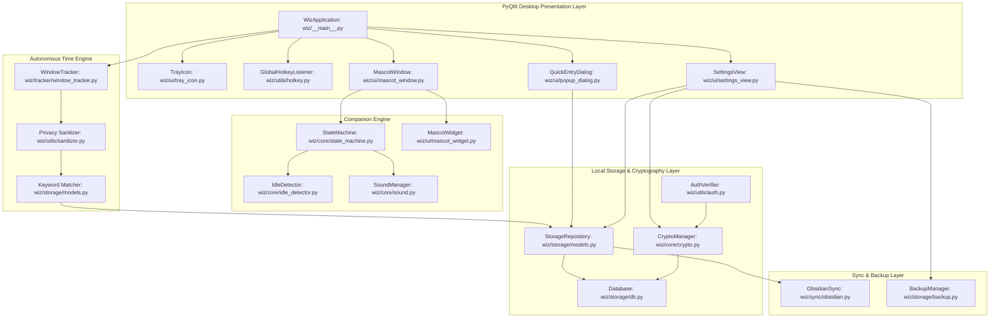

# WizDesk Codebase & System Architecture Specification

This document provides a comprehensive technical overview of the WizDesk architecture, subsystems, and complete codebase map for future feature development and cross-platform porting.

---

## 1. High-Level Architecture Overview

WizDesk is architected around decoupled components communicating through Qt signals, an autonomous time-tracking engine, and a local-first encrypted storage layer.



---

## 2. Interactive Architecture & Feature Map (Archify)

The formal interactive architecture and feature map is generated using the Archify system design framework and is stored directly in `docs/`:

* **Interactive Map Document**: [docs/wizdesk-interactive-map.html](file:///h:/Projects/Wiz/docs/wizdesk-interactive-map.html)
* **Archify Working Build**: [.archify/architecture-wizdesk-map-20261002-123500/wizdesk-interactive-map.html](file:///h:/Projects/Wiz/.archify/architecture-wizdesk-map-20261002-123500/wizdesk-interactive-map.html)
* **Specification File**: [candidate.json](file:///h:/Projects/Wiz/.archify/architecture-wizdesk-map-20261002-123500/candidate.json)
* **Visual Check Report**: [wizdesk-interactive-map.visual-check.html](file:///h:/Projects/Wiz/.archify/architecture-wizdesk-map-20261002-123500/wizdesk-interactive-map.visual-check.html)
* **Verification Status**: All Archify verification gates (`validate`, `deliver`, `check`, `browser-check`, `visual-check`) passed with 0 errors and zero route crossings across light and dark responsive viewports (1440x900 and 2048x1320).

### Key Subsystems & Features Mapped:
1. **Presentation & Quick Capture**: Global Hotkey Listener (`Ctrl+Shift+Space`), `QuickEntryDialog` Workspace Shell, Mascot Companion floating window, and `QuickBarPopup` rapid task/note bars.
2. **Productivity Views**: Tasks & To-Dos Hub (with 24 preset color swatches and keyword rules), Projects Dashboard (Tracked Time KPI hero card, donut and project comparison charts), Timeline & Calendar View, and Timestamped Quick Work Notes.
3. **Autonomous Engines**: 5-second heartbeat Window Tracker, Zero-Snoop Privacy Sanitizer, Mascot State Machine with mood controller, and Procedural Audio / Inactivity Detection.
4. **Local-First Security & Storage**: AES-256-GCM Crypto Manager, Windows Hello Credential Gate, SQLite In-Memory Database with atomic disk flush, Automated Database Backups, and Obsidian Vault Markdown Sync.

---

## 3. Repository Directory Structure

```
h:\Projects\Wiz\
|
+-- assets/                          # Static visual and audio assets
|   +-- icons/                       # Navigation and system icons
|   +-- screenshots/                 # Authentic UI preview screenshots for documentation
|   +-- sounds/                      # Procedurally generated audio tones (.wav)
|   +-- fonts/                       # Embedded custom fonts (Inter, JetBrains Mono)
|
+-- docs/                            # Technical specifications and design documents
|   +-- CODEBASE_ARCHITECTURE.md     # This comprehensive architecture document
|   +-- superpowers/specs/           # Design specifications and architecture proposals
|
+-- tests/                           # Pytest automated test suite (141 unit tests)
|   +-- test_auth.py                 # Windows CredUI and Linux authentication tests
|   +-- test_backup.py               # Database backup snapshot and prune tests
|   +-- test_calendar_view.py        # Calendar grid, recurrence, and schedule tests
|   +-- test_crypto.py               # AES-256-GCM encryption and DPAPI tests
|   +-- test_dialogs.py              # Quick entry, modal dialogues, and theme tests
|   +-- test_hotkey.py               # Global hotkey parser and normalizer tests
|   +-- test_mascot_core.py          # State machine transitions and eye-tracking math
|   +-- test_obsidian_sync.py        # Vault markdown synchronization tests
|   +-- test_pill_number_picker.py   # Duration picker UI component tests
|   +-- test_project_rename.py       # Project cascade rename integrity tests
|   +-- test_projects_dashboard.py   # Project analytics and donut chart tests
|   +-- test_sanitizer.py            # Window title and application name sanitization tests
|   +-- test_sidebar_and_shell.py    # Sidebar pill navigation and collapse tests
|   +-- test_sound.py                # Procedural audio generator tests
|   +-- test_storage.py              # SQLite repository CRUD and session queries
|   +-- test_timeline.py             # Activity timeline aggregation and card tests
|
+-- wiz/                             # Core Python package root
    +-- __init__.py                  # Package identity and version
    +-- __main__.py                  # Application entry point and lifecycle coordinator
    |
    +-- core/                        # Foundational non-UI infrastructure
    |   +-- config.py                # Persistent JSON configuration store
    |   +-- crypto.py                # AES-256-GCM cipher and key derivation
    |   +-- idle_detector.py         # System idle detection via Win32 / POSIX APIs
    |   +-- signals.py               # Centralized Qt application signal dispatcher
    |   +-- sound.py                 # Procedural WAV tone synthesizer and audio player
    |   +-- state_machine.py         # Desktop companion state machine and transitions
    |
    +-- storage/                     # Data access and local database layer
    |   +-- backup.py                # Automated database snapshots and zip backups
    |   +-- db.py                    # SQLite connection, in-memory execution, atomic flush
    |   +-- models.py                # Domain models, schema migrations, and repository CRUD
    |
    +-- sync/                        # External vault synchronization
    |   +-- obsidian.py              # Obsidian daily notes markdown generator and writer
    |
    +-- tracker/                     # Autonomous background activity tracking
    |   +-- window_tracker.py        # Foreground window polling thread and process mapper
    |
    +-- ui/                          # PyQt6 user interface components
    |   +-- arrow_combo.py           # Custom styled dropdown box
    |   +-- calendar_view.py         # Day and week timeline calendar view
    |   +-- chart_widgets.py         # Canvas charts (MicroSparkline, Donut, Bar)
    |   +-- checkbox.py              # Custom animated checkbox component
    |   +-- fonts.py                 # Typography definitions and font loader
    |   +-- help_faq_view.py         # Platform documentation and FAQ viewer
    |   +-- icons.py                 # SVG and pixmap vector icon rasterizer
    |   +-- mascot_widget.py         # Mascot canvas, eye pupil tracking, mood animations
    |   +-- mascot_window.py         # Frameless, transparent floating companion window
    |   +-- pill_number_picker.py    # Interactive number and time badge picker
    |   +-- popup_dialog.py          # Main workspace shell (960x700 multi-view dialog)
    |   +-- project_dashboard_view.py# Project metrics, comparison bars, app donut
    |   +-- quick_bar_dialog.py      # Floating quick task and quick note capture bars
    |   +-- settings_dialog.py       # Modal settings dialog wrapper
    |   +-- settings_view.py         # Multi-tab settings panel (General, Hotkeys, Security)
    |   +-- sidebar_widget.py        # Collapsible navigation rail with vector pill buttons
    |   +-- timeline_view.py         # Activity timeline, session cards, milestone cards
    |   +-- tray_icon.py             # System tray icon and context menu
    |
    +-- utils/                       # System helpers and privacy utilities
        +-- auth.py                  # Windows CredUI / Linux Polkit user authentication
        +-- hotkey.py                # Global shortcut listener (pynput)
        +-- sanitizer.py             # Window title redactor and clean application name
```

---

## 4. Module Map and Exact Line References

### 4.1 Entry Point and Coordination

* **[wiz/\_\_main\_\_.py](file:///h:/Projects/Wiz/wiz/__main__.py)**:
  * `set_windows_app_id` ([L32-L40](file:///h:/Projects/Wiz/wiz/__main__.py#L32-L40)): Sets Windows `AppUserModelID` for notification and taskbar grouping.
  * `WizApplication` ([L42-L215](file:///h:/Projects/Wiz/wiz/__main__.py#L42-L215)): Central lifecycle coordinator.
    * `__init__` ([L45-L83](file:///h:/Projects/Wiz/wiz/__main__.py#L45-L83)): Instantiates `StorageRepository`, `StateMachine`, `ObsidianSync`, `MascotWindow`, `TrayIcon`, `WindowTracker`, and `GlobalHotkeyListener`.
    * `start` ([L85-L105](file:///h:/Projects/Wiz/wiz/__main__.py#L85-L105)): Starts background worker threads, checks single-instance local server lock, and shows initial mascot window.
    * `_connect_signals` ([L107-L148](file:///h:/Projects/Wiz/wiz/__main__.py#L107-L148)): Binds global hotkeys, quick entry triggers, and theme synchronization.
    * `stop` ([L165-L195](file:///h:/Projects/Wiz/wiz/__main__.py#L165-L195)): Gracefully stops tracker thread, hotkey listener, and flushes database to disk.
  * `main` ([L218-L266](file:///h:/Projects/Wiz/wiz/__main__.py#L218-L266)): CLI parser, application setup, and Qt event loop initialization.

### 4.2 Core Subsystem

* **[wiz/core/config.py](file:///h:/Projects/Wiz/wiz/core/config.py)**:
  * `Config` ([L10-L213](file:///h:/Projects/Wiz/wiz/core/config.py#L10-L213)): Manages `~/.wizdesk/config.json`.
    * `get` / `set` ([L129-L137](file:///h:/Projects/Wiz/wiz/core/config.py#L129-L137)): Key-value configuration access.
    * `window_position` / `save_window_position` ([L145-L157](file:///h:/Projects/Wiz/wiz/core/config.py#L145-L157)): Preserves mascot screen coordinates across reboots.
* **[wiz/core/crypto.py](file:///h:/Projects/Wiz/wiz/core/crypto.py)**:
  * `get_machine_bound_kdf_key` ([L29-L36](file:///h:/Projects/Wiz/wiz/core/crypto.py#L29-L36)): Derives machine-bound key using MAC address and user ID for non-Windows platforms.
  * `CryptoManager` ([L39-L214](file:///h:/Projects/Wiz/wiz/core/crypto.py#L39-L214)):
    * `generate_key` ([L48-L50](file:///h:/Projects/Wiz/wiz/core/crypto.py#L48-L50)): Generates cryptographically secure 256-bit AES key.
    * `store_key_dpapi` ([L89-L117](file:///h:/Projects/Wiz/wiz/core/crypto.py#L89-L117)): Encrypts master key using Windows DPAPI or host-bound KDF.
    * `load_key_dpapi` ([L119-L147](file:///h:/Projects/Wiz/wiz/core/crypto.py#L119-L147)): Decrypts master key from DPAPI blob.
    * `encrypt_payload` ([L163-L175](file:///h:/Projects/Wiz/wiz/core/crypto.py#L163-L175)): Authenticated AES-256-GCM encryption with 12-byte random nonce.
    * `decrypt_payload` ([L178-L202](file:///h:/Projects/Wiz/wiz/core/crypto.py#L178-L202)): Authenticated AES-256-GCM decryption with tag verification.
* **[wiz/core/idle_detector.py](file:///h:/Projects/Wiz/wiz/core/idle_detector.py)**:
  * `get_system_idle_seconds` ([L17-L37](file:///h:/Projects/Wiz/wiz/core/idle_detector.py#L17-L37)): Queries Windows `GetLastInputInfo` to measure seconds of inactivity.
* **[wiz/core/signals.py](file:///h:/Projects/Wiz/wiz/core/signals.py)**:
  * `AppSignals` ([L6-L39](file:///h:/Projects/Wiz/wiz/core/signals.py#L6-L39)): Decoupled Qt signals: `task_completed`, `task_action`, `activity_logged`, `request_quick_entry`, `hotkeys_changed`, `theme_changed`.
* **[wiz/core/sound.py](file:///h:/Projects/Wiz/wiz/core/sound.py)**:
  * `WavSynthesizer` ([L14-L172](file:///h:/Projects/Wiz/wiz/core/sound.py#L14-L172)): Procedural sine, chirp, and chime audio wave generator using Python math.
  * `SoundManager` ([L175-L299](file:///h:/Projects/Wiz/wiz/core/sound.py#L175-L299)): Plays non-blocking sounds for state changes, task actions, and companion pokes.
* **[wiz/core/state_machine.py](file:///h:/Projects/Wiz/wiz/core/state_machine.py)**:
  * `MascotState` ([L13-L31](file:///h:/Projects/Wiz/wiz/core/state_machine.py#L13-L31)): Enum of states: `IDLE`, `WORKING`, `NOTIFY`, `COMPLETE`, `SLEEP`.
  * `StateMachine` ([L34-L222](file:///h:/Projects/Wiz/wiz/core/state_machine.py#L34-L222)):
    * `set_state` ([L120-L143](file:///h:/Projects/Wiz/wiz/core/state_machine.py#L120-L143)): Manages state transitions, play-sound hooks, and transient timeouts.
    * `_check_idle_state` ([L196-L222](file:///h:/Projects/Wiz/wiz/core/state_machine.py#L196-L222)): Inactivity checker transitioning companion to `SLEEP`.

### 4.3 Storage and Database Subsystem

* **[wiz/storage/db.py](file:///h:/Projects/Wiz/wiz/storage/db.py)**:
  * `Database` ([L95-L516](file:///h:/Projects/Wiz/wiz/storage/db.py#L95-L516)):
    * `_init_encrypted_mode` ([L137-L205](file:///h:/Projects/Wiz/wiz/storage/db.py#L137-L205)): Decrypts on-disk database file into an in-memory SQLite database (`:memory:`).
    * `_flush_to_disk` ([L265-L293](file:///h:/Projects/Wiz/wiz/storage/db.py#L265-L293)): Serializes in-memory database and writes atomically using encrypted payload.
    * `cursor` ([L309-L336](file:///h:/Projects/Wiz/wiz/storage/db.py#L309-L336)): Context manager supplying thread-safe cursors with auto-commit.
    * `enable_encryption` / `disable_encryption` ([L398-L485](file:///h:/Projects/Wiz/wiz/storage/db.py#L398-L485)): Migrates unencrypted databases to encrypted and vice versa.
    * `close` ([L487-L510](file:///h:/Projects/Wiz/wiz/storage/db.py#L487-L510)): Commits, flushes to disk, and zeroes in-memory decryption buffers.
* **[wiz/storage/models.py](file:///h:/Projects/Wiz/wiz/storage/models.py)**:
  * `StorageRepository` ([L129-L1605](file:///h:/Projects/Wiz/wiz/storage/models.py#L129-L1605)):
    * `log_session` ([L175-L203](file:///h:/Projects/Wiz/wiz/storage/models.py#L175-L203)): Records active foreground application usage session.
    * `create_task` / `update_task_status` ([L325-L374](file:///h:/Projects/Wiz/wiz/storage/models.py#L325-L374)): Hierarchical task creation and status tracking.
    * `create_subtask` / `update_subtask_status` ([L535-L566](file:///h:/Projects/Wiz/wiz/storage/models.py#L535-L566)): Child task operations.
    * `get_task_hierarchy` ([L581-L735](file:///h:/Projects/Wiz/wiz/storage/models.py#L581-L735)): Reconstructs task tree with scheduled date and recurrence logic.
    * `create_or_update_project` ([L770-L810](file:///h:/Projects/Wiz/wiz/storage/models.py#L770-L810)): Registers project with auto-tagging keyword rules.
    * `match_project_tag` ([L936-L946](file:///h:/Projects/Wiz/wiz/storage/models.py#L936-L946)): Matches window title substrings to project tags.
    * `get_dashboard_analytics` ([L1146-L1450](file:///h:/Projects/Wiz/wiz/storage/models.py#L1146-L1450)): Aggregates time metrics for project comparison bars and app distribution donuts.
    * `get_day_timeline_events` ([L1539-L1590](file:///h:/Projects/Wiz/wiz/storage/models.py#L1539-L1590)): Merges sessions, completed tasks, and notes into unified timeline.
    * `aggregate_sessions` ([L1608-L1658](file:///h:/Projects/Wiz/wiz/storage/models.py#L1608-L1658)): Condenses consecutive short session polls into clean blocks.
* **[wiz/storage/backup.py](file:///h:/Projects/Wiz/wiz/storage/backup.py)**:
  * `BackupManager` ([L18-L227](file:///h:/Projects/Wiz/wiz/storage/backup.py#L18-L227)): Automated snapshot creation, zip archiving, and restore operations.

### 4.4 Tracker and Utilities

* **[wiz/tracker/window_tracker.py](file:///h:/Projects/Wiz/wiz/tracker/window_tracker.py)**:
  * `get_active_window_info` ([L57-L95](file:///h:/Projects/Wiz/wiz/tracker/window_tracker.py#L57-L95)): Windows API foreground window inspection using `GetForegroundWindow` and `psutil`.
  * `WindowTracker` ([L98-L206](file:///h:/Projects/Wiz/wiz/tracker/window_tracker.py#L98-L206)): `QThread` polling loop (every 5 seconds) logging continuous sessions.
* **[wiz/utils/sanitizer.py](file:///h:/Projects/Wiz/wiz/utils/sanitizer.py)**:
  * `clean_app_name` ([L38-L48](file:///h:/Projects/Wiz/wiz/utils/sanitizer.py#L38-L48)): Removes `.exe` extension case-insensitively for clean UI presentation.
  * `sanitize_window_title` ([L51-L66](file:///h:/Projects/Wiz/wiz/utils/sanitizer.py#L51-L66)): Redacts sensitive window titles (passwords, banking, private browsing).
* **[wiz/utils/auth.py](file:///h:/Projects/Wiz/wiz/utils/auth.py)**:
  * `_prompt_windows_credentials` ([L66-L159](file:///h:/Projects/Wiz/wiz/utils/auth.py#L66-L159)): Uses Windows CredUI and `LogonUser` to verify Windows user credentials.
  * `authenticate_user` ([L171-L185](file:///h:/Projects/Wiz/wiz/utils/auth.py#L171-L185)): Unified OS identity verification interface for recovery key exports.
* **[wiz/utils/hotkey.py](file:///h:/Projects/Wiz/wiz/utils/hotkey.py)**:
  * `GlobalHotkeyListener` ([L60-L113](file:///h:/Projects/Wiz/wiz/utils/hotkey.py#L60-L113)): Intercepts background shortcuts using `pynput.keyboard.GlobalHotKeys`.

### 4.5 User Interface Subsystem

* **[wiz/ui/popup_dialog.py](file:///h:/Projects/Wiz/wiz/ui/popup_dialog.py)**:
  * `QuickEntryDialog` ([L85-L3481](file:///h:/Projects/Wiz/wiz/ui/popup_dialog.py#L85-L3481)): Main workspace window. Houses `SideNavBar`, multi-view stacked layout (Tasks, Projects Dashboard, Activity Timeline, Calendar, Notes, Settings, Documentation), and frameless drag bar.
* **[wiz/ui/project_dashboard_view.py](file:///h:/Projects/Wiz/wiz/ui/project_dashboard_view.py)**:
  * `ProjectsOverviewPage` ([L575-L1055](file:///h:/Projects/Wiz/wiz/ui/project_dashboard_view.py#L575-L1055)): High-level KPI summary, Project Comparison bar charts, App Distribution donut, and project list.
  * `ProjectDetailPage` ([L1058-L1741](file:///h:/Projects/Wiz/wiz/ui/project_dashboard_view.py#L1058-L1741)): Deep-dive into single project tasks, keyword rules, and app breakdown.
* **[wiz/ui/timeline_view.py](file:///h:/Projects/Wiz/wiz/ui/timeline_view.py)**:
  * `TimelineView` ([L335-L741](file:///h:/Projects/Wiz/wiz/ui/timeline_view.py#L335-L741)): Chronological day timeline rendering `AppSessionCard` and `MilestoneCard`.
* **[wiz/ui/calendar_view.py](file:///h:/Projects/Wiz/wiz/ui/calendar_view.py)**:
  * `CalendarView`: Visual schedule view rendering recurring and scheduled tasks across days and weeks.
* **[wiz/ui/chart_widgets.py](file:///h:/Projects/Wiz/wiz/ui/chart_widgets.py)**:
  * `ProjectComparisonChart` ([L762-L1350](file:///h:/Projects/Wiz/wiz/ui/chart_widgets.py#L762-L1350)): Dual-mode bar chart (Horizontal & Grouped Vertical) with animated hover highlights.
  * `AppUsageDonutCanvas` ([L1352-L1540](file:///h:/Projects/Wiz/wiz/ui/chart_widgets.py#L1352-L1540)): High-performance donut chart rendering proportional slices, hover animations, and center label text.
* **[wiz/ui/mascot_window.py](file:///h:/Projects/Wiz/wiz/ui/mascot_window.py)** and **[wiz/ui/mascot_widget.py](file:///h:/Projects/Wiz/wiz/ui/mascot_widget.py)**:
  * Floating transparent companion window rendering vector character states with real-time mouse cursor eye tracking.

---

## 5. Linux Porting Guidelines and Extension Points

When implementing the Linux version, developers must target the following provider interfaces:

1. **Window Tracking (`wiz/tracker/`)**:
   * Create `wiz/tracker/backends/linux_x11.py` using `python-xlib` or EWMH (`_NET_ACTIVE_WINDOW`, `_NET_WM_PID`, `_NET_WM_NAME`).
   * Create `wiz/tracker/backends/linux_wayland.py` querying GNOME Shell Mutter D-Bus and KDE KWin D-Bus.
2. **Idle Detection (`wiz/core/idle_detector.py`)**:
   * Implement POSIX branch using `libXss.so` (XScreenSaver) on X11 and `org.freedesktop.ScreenSaver` on Wayland.
3. **Authentication (`wiz/utils/auth.py`)**:
   * Implement `_prompt_linux_credentials` calling `pkexec` (Polkit Agent) or Polkit-1 D-Bus interface.
4. **Global Shortcuts (`wiz/utils/hotkey.py`)**:
   * Retain `pynput` for X11 sessions; support CLI IPC dispatch (`wizdesk --quick-task`, `wizdesk --toggle-workspace`) via `QLocalServer` for Wayland custom shortcuts.
